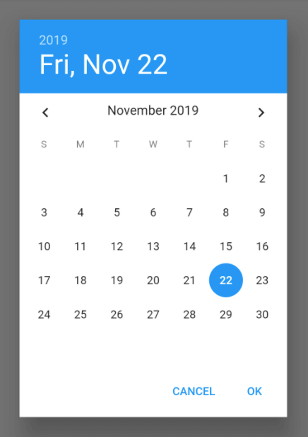
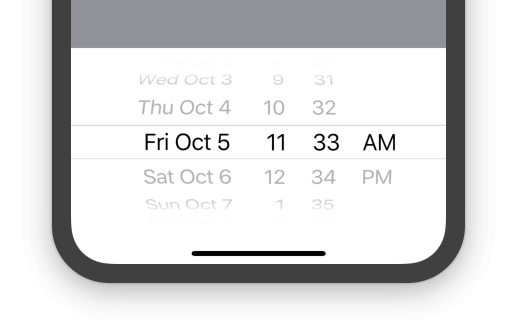
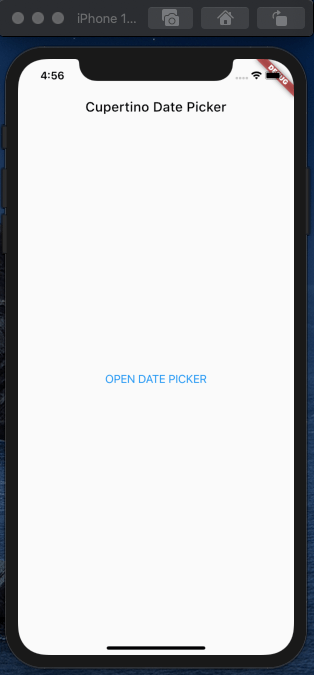
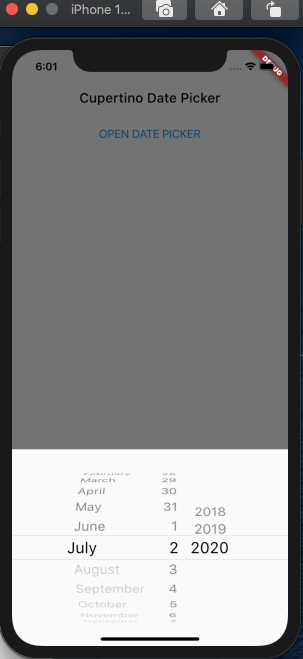

디자인 시스템 없이 Flutter 를 사용하는 대부분의 개발자들이 Material Design 을  
많이 사용할 것 으로 본다.  

그 중 DatePicker 같은 경우 cupertino 와 Material 의 차이가  
가장 많이 나는 위젯 중 하나라고 볼 수 있다. 

Material 에서는 달력 자체가 나타나는 반면, cupertino 에서는 bottom bar 가 나타나며  
선택하는 모양으로 표현했다. 






둘 중 원하는 뭘 선택해도 되지만, 여기서는 cupertino 의 date picker 를 살펴보자.  
cupertino 의 date picker 를 사용할 경우
onDateTimeChanged 라는 콜백함수로  
날짜 데이터 변경을 알 수 있다.

여기에 날짜를 변경 한 뒤 사용자가 직접 제어할 수 있도록  
cancel 과 done 기능을 추가해보자.

### Init Project

일단 신규 프로젝트에서 cupertino date picker 를 불러오는 버튼을
설정 하자.

```javascript
    return MaterialApp(
      home: Scaffold(
        appBar: AppBar(
          brightness: Brightness.light,
          backgroundColor: Colors.transparent,
          elevation: 0.0,
          title: Text(
            'Cupertino Date Picker',
            style: TextStyle(
              color: Colors.black,
            ),
          ),
        ),
        body: SafeArea(
          child: Column(
            crossAxisAlignment: CrossAxisAlignment.center,
            children: [
              Center(
                child: CupertinoButton(
                  child: Text(
                    'OPEN DATE PICKER',
                    textAlign: TextAlign.center,
                  ),
                  onPressed: () {},
                ),
              ),
            ],
          ),
        ),
      ),
    );
```



Cupertino DatePicker 같은 경우 해당 DatePicker 를 보여주고
말고는 위젯 자체를 숨기거나 보여주거나 해야 한다.

(Scaffold 에서 지원하는 게 아닌 datepicker 위젯을 만들어두고
 해당 위젯을 보여줄 지 말지 직접 컨트롤 해야 한다.)

이를 위해 일단 Cupertino DatePicker 위젯을 별도로 만들자.


### Create Cupertino Date Picker

> `/lib/date_picker.dart`

```javascript
  import 'package:flutter/cupertino.dart';

class CuDatePicker extends StatelessWidget {
  const CuDatePicker({Key key}) : super(key: key);

  @override
  Widget build(BuildContext context) {
    return CupertinoDatePicker(
      initialDateTime: DateTime.now(),
      maximumDate: new DateTime.now(),
      minimumYear: 2018,
      maximumYear: 2020,
      mode: CupertinoDatePickerMode.date,
      onDateTimeChanged: (DateTime value) {},
    );
  }
}
```

(date picker 에 들어간 설정은 이름만 봐도 뭘 하는건지  
 알 수 있으리라 생각한다.)  

만들어진 DatePicker 를 메인화면에 적용해보면


해당 화면처럼 나온다.  
(버튼은 위치는 위로 올렸다. 스샷 다시 찍기 귀찮음..)  

모양은 나오지만 우리가 원하는 건 아이폰처럼 하단에 적절한 크기와  
모양으로 나타나길 원한다.  
이제 위치와 크기를 수정 해보자.  

우리는 date picker 를 scaffold 에서 제공하는 bottom sheet 에서
나타나도록 별도로 수정 할 것이다.

그리고 해당 bottom sheet 의 높이를 설정하고,  
date-picker 내부의 width 를 제한 할 것이다.  

(이는 landscape 레이아웃 에서의 문제 때문이다.  
뒤에서 설명 할 것 이다.)

그럼 크게 Todo 를 정리해보자.

* 버튼으로 bottom modal sheet 를 Toggle 할 수 있어야 한다.
* Date Picker 는 Cancel, Done 라는 별도의 컨트롤 버튼이 존재한다.
* Date Picker 가 나타내는 시각은 한국 시간에 맞춘다.


### 버튼으로 BottomModal 컨트롤

showModalBottomSheet 같은 경우 Future<void> 를 반환한다.  
Widget 이 아니라 Future 를 반환 하기 때문에 뭔가 버튼이나 제스처에  
연결 시켜 사용해야 편하니 기존 버튼을 별도로 export 하여 만들자.  

```javascript
class _BuildButton extends StatelessWidget {
  const _BuildButton({
    Key key,
    @required this.showPicker,
  }) : super(key: key);

  final Function(BuildContext context) showPicker;

  @override
  Widget build(BuildContext context) {
    return CupertinoButton(
      child: Text(
        'OPEN DATE PICKER',
      ),
      onPressed: () {
        showPicker(context);
      },
    );
  }
}
```

간단하게 버튼을 분리했다.  
이제는 해당 showPicker 함수에 date picker 를 넣어주면 된다.


```javascript
    Future<void> showPicker(BuildContext context) {
    return showModalBottomSheet(
      context: context,
      builder: (BuildContext context) {
        return CuDatePicker();
      },
    );
  }
```

Root Widget (여기서는 MyApp) 에 showPicker 함수를 만들어주자.  

### Create Bottom Modal Sheet

이제 DatePicker 의 모양을 변경 해야한다. 

height 를 조정하고 내부 width 를 제한 할 것 이다.  
height 의 크기는 현재 스크린의 약 3/1 정도를 차지하도록 만들 것 이다.  

현재 스크린의 3/1 길이..  
반응형으로 생각하면 현재 디바이스 스크린의 길이를  
구하는 유틸 함수를 미리 만들어 두자.

```javascript
double getHeightByPercentOfScreen(double percent,  BuildContext context) {
  return MediaQuery.of(context).size.height * percent / 100;
}
```

현재 스크린의 크기에서 원하는 퍼센테이지를 입력 받아 그 길이를  
구하는 함수이다.  
조금만 손 보면 당연히 width 길이도 구할 수 있다.

그럼 hegiht 를 구했고, 내부 width 의 크기는 퍼센테이지로 구해도 되지만,  
기존 모바일의 길이를 생각히면 maxwidth 를 400 으로 정했다.

showPicker 함수를 수정하고 datePicker 위젯에 width 제한을 두자.

>`lib/main.dart`
```javascript
  Future<void> showPicker(BuildContext context) {
    return showModalBottomSheet(
      context: context,
      builder: (BuildContext context) {
        return Container(
          height: getHeightByPercentOfScreen(33.0, context),
          child: CuDatePicker(),
        );
      },
    );
  }
```

>`lib/date_picker.dart`

```javascript
import 'package:flutter/cupertino.dart';

class CuDatePicker extends StatelessWidget {
  const CuDatePicker({
    Key key,
    this.onDateChange,
  }) : super(key: key);

  final Function(DateTime value) onDateChange;

  @override
  Widget build(BuildContext context) {
    return Container(
      constraints: BoxConstraints(
        maxWidth: 400.0,
      ),
      child: CupertinoDatePicker(
        initialDateTime: DateTime.now(),
        maximumDate: new DateTime.now(),
        minimumYear: 2018,
        maximumYear: 2020,
        mode: CupertinoDatePickerMode.date,
        onDateTimeChanged: onDateChange ?? (DateTime value) {},
      ),
    );
  }
}

```

이제 한번 date-picker 를 소환해보자.



이제 어느정도 모양이 잡혔다.  
하지만 아직 부족하다.  

### Create Cancel, Done Buttons

날짜 선택 후 실행 될 또다른 로직을 위해  
추가로 Done 버튼과 Cancel 버튼을 추가해주자.  

우리는 bottom sheet 를 7:3 비율로 나눠서
상단(3) 에 버튼을 두고,  
하단(7) 에 날짜 선택을 넣을 것 이다.

그러기 위해 버튼 부분의 위젯을 만들고, bottomSheet 에  
Column 위젯을 추가 할 것이다. 

먼저 2개의 버튼 셋이 포함 된 위젯.

```javascript
class _BuildButtonSet extends StatelessWidget {
  const _BuildButtonSet({
    Key key,
    this.onPressCancel,
    this.onPressDone,
  }) : super(key: key);

  final Function onPressCancel;
  final Function onPressDone;

  @override
  Widget build(BuildContext context) {
    return Row(
      crossAxisAlignment: CrossAxisAlignment.center,
      mainAxisAlignment: MainAxisAlignment.spaceBetween,
      children: [
        CupertinoButton(
          child: Text(
            'Cancel',
            style: TextStyle(
              color: Colors.red,
            ),
          ),
          onPressed: onPressCancel ??
              () {
                Navigator.pop(context);
              },
        ),
        CupertinoButton(
          child: Text(
            'Done',
          ),
          onPressed: onPressCancel ??
              () {
                Navigator.pop(context);
              },
        ),
      ],
    );
  }
}
```

Cancel 과 Done , 2개의 버튼을 가진 위젯이 완성 되었으니  
이제 DatePicker 와 합치기 위해 showPicker 함수를 수정하자.

```javascript
    Future<void> showPicker(BuildContext context) {
    return showModalBottomSheet(
      context: context,
      builder: (BuildContext context) {
        return Container(
          height: getHeightByPercentOfScreen(33.0, context),
          child: Column(
            children: [
              Expanded(
                flex: 3,
                child: _BuildButtonSet(),
              ),
              Expanded(
                flex: 7,
                child: CuDatePicker(),
              )
            ],
          ),
        );
      },
    );
  }
```


이제 원하는 date picker 가 완성되었다.  
여기서 추가로 디자인이나 크기를 원하는 상태로 수정 하면 된다.  
로직은 onPressCancel, onPressDone, onDateChange 에  
적절히 넣어서 사용하면 된다.

### Localization

마지막으로 DatePicker 에 나오는 시간을 한국 시간으로 변경해보자.  
localization 을 하기 위해 pubspec.yaml 에서 flutter_localizations 을 추가하자.  

```javascript
...
  dependencies:
  flutter:
    sdk: flutter
  flutter_localizations:
    sdk: flutter
...
```

그리고 main.dart 의 MaterailApp 에서
localization 관련 코드를 추가하자.

```javascript
      return MaterialApp(
      localizationsDelegates: [
        GlobalMaterialLocalizations.delegate,
        GlobalWidgetsLocalizations.delegate,
        GlobalCupertinoLocalizations.delegate,
      ],
      supportedLocales: [
        const Locale('ko', 'KO'),
        const Locale('en', 'US'),
      ],
      home: ...
```

이제 앱을 리셋 시키고 다시 date picker 를 열어보면


한글로 변경 된 picker 를 볼 수 있다.    
여기서 만약 한글로 변경 되지 않는다면 해당 모바일 폰의 설정 에서  
지역과 언어를 한국으로 변경해보자.

추가로 DateTime 설정에 관해서 쓸 내용도 있지만 이는 별도로  
글을 써서 정리를 해보겠다.  

위 예제의 전체 코드 
 
Github: https://github.com/WillowRyu/flutter-cupertino-datepicker 


출처: 내 머리..