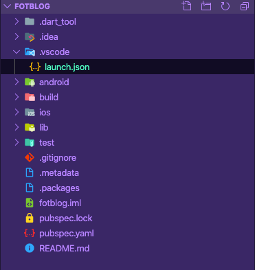
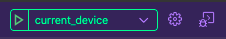
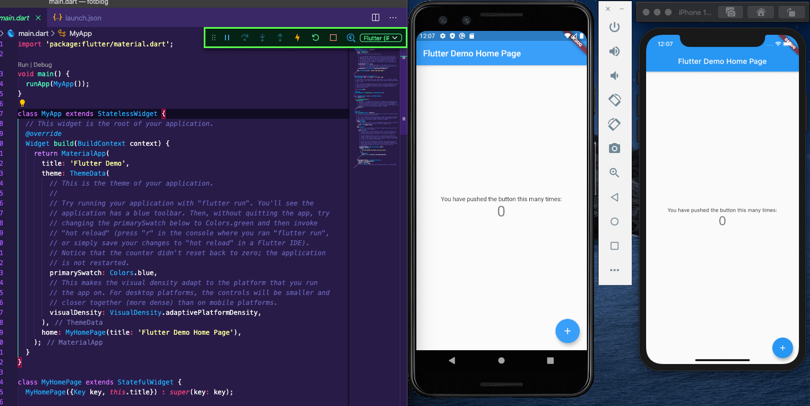
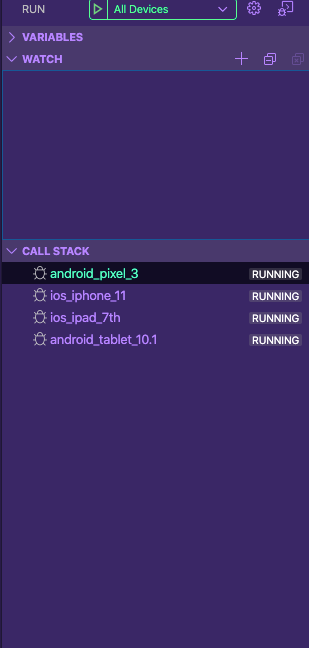
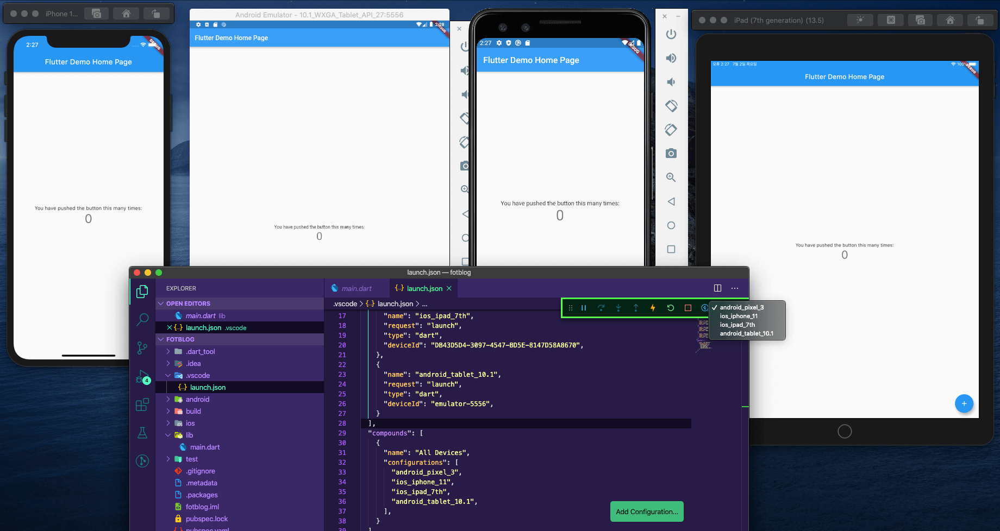

Flutter 는 구글에서 공개한 크로스플랫폼 프레임워크다.
모바일 만이 아닌 웹과 데스크탑도 지원하지만, 아마 대부분 모바일로 
개발 하고 있으리라 본다.

Flutter 의 렌더링 특성 상 개발한 UI 는iOS 와 Android 에서 똑같은 화면을 나타내지만,  
그래도 기기 별로 보고 싶거나, 실제 기기와 
동시에 보면서 개발 하고 싶을 수 있다.  

예를 들면 태블릿 버전도 동시에 개발하거나,  
iphone 5 를 지원 한다거나, 다양한 사이즈의 모바일을 동사에 보고 싶거나..

이럴때 시뮬레이터든 실제 기기를 사용하든 PC 의 사양이 받쳐주는  
한계 까지 동시에 디버깅 하는 방법이 있다.  
본인은 이번에 Tablet 과 mobile 사이즈를 둘 다 지원하는 반응형 앱을 개발 했기에  
유용하게 써먹은 기능이다.

이름하여 
## Flutter Octopus !!
(실제로 저 이름이 맞다)


실제로 사용 해보자.  
신규 프로젝트로 실제 iphone 11, ipad, pixel 3, android Tablet 총 4개의 기기를  
실행 하여 동시에 디버깅 해보자.

### Create Configurations

vscode 의 디버깅 탭에서 Add configuration 을 클릭하자.  
자동으로 루트 폴더에 .vscode 폴더와 launch.json 이 생성된다.



launch.json 에는 flutter 디버깅 할때 사용 할 디바이스 정보는
- name
- request
- type
- device id

가 필요하다.  
간단하게 첫번째 device 를 등록해보자.

```javascript
{
  "version": "0.2.0",
  "configurations": [
    {
      "name": "current_device",
      "request": "launch",
      "type": "dart"
    }
  ]
}
```

그리고 vscode 의 디버깅 탭을 보면 current_device 라는 이름의
디버깅 타겟이 생성된 걸 볼 수 있다.


위 설정에서 특정 device id 를 지정하지 않았기 때문에 
해당 디버깅은 현재 타겟으로 설정 되어 있는 디바이스를 대상으로 한다.

그럼 이제 여기서
안드로이드의 pixel 3 시뮬레이터 기기를 등록해보자.

```javascript
{
  "version": "0.2.0",
  "configurations": [
    {
      "name": "android_pixel_3",
      "request": "launch",
      "type": "dart",
      "deviceId": "emulator-5554"
    }
  ]
}
```

deviceId 같은 경우 Android 는
> `adb devices`

명령어로 해당 device 의 아이디를 알 수 있다.

이제 디버깅 탭에 android_pixel_3 라는 타겟이 생성 되었을 것 이다.

기존 타겟과 함께 pixel 3 를 실행시키기 위해 먼저 기존 타겟을  
디버깅 하고 그 후 디버깅 탭에서 android_pixel_3 를 실행시키자.

결과는 ?



스크린샷에서 보이듯이 iphone 11, pixel 3 가 동시에
디버깅 되고 있다.  
심지어 핫 리로드도 동시에 진행된다.

### Multiple Device Configurations

이번에는 iPad 와 Android Tablet 을 추가하여
총 4대를 동시에 돌려보자.

그리고 iphone 11 역시 별도로 디바이스 id 를 입력하여  
원클릭으로 4대의 기기를 동시 디버깅 할 수 있도록 변경하자.  
참고로 ios simulator 기기의 device id 는

> `instruments -s devices`

명령어로 알수 있다.

```javascript
    "configurations": [
    {
      "name": "android_pixel_3",
      "request": "launch",
      "type": "dart",
      "deviceId": "emulator-5554",
    },
    {
      "name": "ios_iphone_11",
      "request": "launch",
      "type": "dart",
      "deviceId": "2EDE7A91-FB2D-413C-8EEA-139543D33623",
    },
    {
      "name": "ios_ipad_7th",
      "request": "launch",
      "type": "dart",
      "deviceId": "DB43D5D4-3097-4547-BD5E-8147D58A8670",
    },
    {
      "name": "android_tablet_10.1",
      "request": "launch",
      "type": "dart",
      "deviceId": "emulator-5556",
    }
  ]
```  


2대의 태블릿과 2대의 모바일을 등록하였다.  
이제 디버깅 탭에서 하나하나 실행하면 4대 동시 디버깅이 가능하다.  
그런데 여기서 일일이 하나하나 실행하기에는 굉장히 귀찮은 작업이다.  
4대도 귀찮은데 기기가 더 늘어난다면 이 얼마나 비효율 적인 작업인가.

그래서 한번의 클릭으로 동시에 실행시키는 명령어를 만들어보자.  
configurations 밑에 compounds 라는 항목을 추가하자.

```javascript
  "configurations": [
    ...
  ],
  "compounds": [
    {
      "name": "All Devices",
      "configurations": [
        "android_pixel_3",
        "ios_iphone_11",
        "ios_ipad_7th",
        "android_tablet_10.1",        
      ],
    }
  ]
```
name 에는 원하는 타겟 명령 이름을 기입하고,  
configurations 에는 해당 명령을 실행 할 때,
포함되는 설정들을 넣는다.  
우리는 위에서 만든 4개의 디바이스 설정을 넣었다.

자 이제 디버깅 탭에서 All Devices 라는 이름을 볼 수 있을 것 이다.  
한번 실행해보자.





4개의 기기를 동시에 디버깅 하는 모습을 확인 할 수 있다.  
실제로 개발 할 때 특별한 경우가 아니면 시뮬레이터를 4대,5대 돌리면서  
디버깅하진 않을 것 이다.  

완성된 앱에서 약간의 수정이 필요 할 경우 동시에 켜두고 비교 해보기 좋다.  
또는 다양한 사이즈의 UI 를 비교하거나.

아니면 안드로이드와 아이폰의 UI 를 같이 볼 경우,  
또는 반응형 앱을 만들 경우 모바일과 태블릿을 동시에 디버깅 하기에 좋은 기능이다.

해당 기능의 자세한 설명은  
(https://github.com/flutter/flutter/wiki/Multi-device-debugging-in-VS-Code)

위 링크를 참조하자.

이글이 누군가에게 도움이 되었길 바란다.