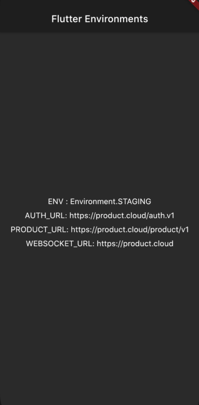

밀린 글들이 많은데 시간이 없어서 못 올리는중 🤔

web 개발에서 온 사람들은 flutter 를 이용해 실제 제품 개발 시  
'그러고보니 환경변수는 어떻게 설정하지?'  
라는 의문이 들었을 것 이다.

아마 대부분 react 를 사용 했을텐데, .env 파일로 통일 시켜서  
간편하게(?) 설정을 해왔을 텐데 (이는 angular 도 마찬가지다)  
flutter 에선 어떻게 설정해야 할까?

공식 홈페이지에 친절하게 설정하는 법이 있다면 좋겠지만  
아쉽게도 친절한 가이드는 없다.  

그래서 실제 개발 시 사용했던 방법을 공유하고자 한다.  
사실 이 방법도 구글링으로 어디선가 에서 보고 적용한 부분인데  
해당 글이 어딨는지 기억이 나지 않아 출처를 적을 수가 없다..  
만약 기억난다면 그때 출처를 적용하겠다.  

환경변수는 여러가지 용도로 사용되지만 가장 많이 쓰이는 부분이  
아무래도 API Endpoint 를 개발 환경 별로 적용할 때 많이 쓸 것 이다.  

이번글은 기존 web 개발과 깉은 순서로 앱이 구동되기 전  
환경별 변수를 적용시켜 앱 내에서 사용해보자.

### Init Project

내가 적는 모든 글은 이전 글과 이어지지 않고, 기존 repo 를 가져와  
사용하지 않으며 독립적으로 무조건 새로운 프로젝트에서 시작할 것 이다.

새로운 프로젝트를 만들어 main 부분을 정리하자.  


### Create EnvSetting Class

env 셋팅에서 우리는 2개의 클래스를 만들 것 이다.
실제 앱 환경에서 가져와서 사용 할 클래스, 그리고 환경 변수를 환경에 맞게 설정 해주는 할 클래스 이다.  

먼저 환경 별 선택을 위한 열거형을 하나 만들자.

>`/lib/core/env.dart`

```javascript
 enum Environment { DEV, STAGING, PROD }
```

스테이징, 개발, 제품 버전의 환경을 만들 것 이다.  
필요하다면 당연히 저기서 늘려도 된다.  

이제 실제로 환경 변수를 설정 하는 클래스를 만들자.

>`/lib/core/env.dart`

```javascript
  ...
  class _Config {
    static const AUTH_URL = 'AUTH';
    static const PRODUCT_URL = 'PRODUCT';
    static const WEBSOCKET_URL = 'WEBSOCKET';

    static const String devPrefix = 'https://dev.cloud';
    static const String productPrefix = 'https://product.cloud';
  }
```

일단 예제로 사용 할 URL 은 3가지 인데 당연히 알아서 잘 늘려 사용할 것 으로 본다.  
prefix 같은 경우 공통적으로 쓰는 endpoint 의 앞 부분이다.  

이제 환경 별로 URL 을 넣어보자.  

```javascript
  class _Config {
    ...

    static Map<String, String> debugConstants = {
      AUTH_URL: '$devPrefix/auth/v1',
      PRODUCT_URL: '$devPrefix/product/v1',
      WEBSOCKET_URL: '$devPrefix',
    }

    static Map<String, String> productConstants = {
      AUTH_URL: '$productPrefix/auth/v1',
      PRODUCT_URL: '$productPrefix/product/v1',
      WEBSOCKET_URL: '$productPrefix',
    };

    static Map<String, String> stagingConstants = {
      AUTH_URL: '$productPrefix/auth/v1',
      PRODUCT_URL: '$productPrefix/product/v1',
      WEBSOCKET_URL: '$productPrefix',
    };
  }
```

debug, prod, staging 마다 각 변수에 맞는 url 을 대입한다.  
간단하지 않은가?  
저기서 늘리든 줄이든 커스텀하게 바꾸든 필요에 따라 변경하면 된다.  

환경 별 값을 설정하는 클래스는 완성되었다.  
이제 현재 어떠한 환경인지 파악해 위 _Config 클래스에서 해당 환경에 맞는  
값을 가져오는 클래스를 만들어야 한다.  
이 역시 간단하다.  

새로운 클래스를 만들자.  


### Create Environments Class

>`/lib/core/env.dart`

```javascript
class Environments {
  static Map<String, dynamic> _config;
  static Environment _currentEnv;
}
```

_config 에서는 설정한 환경변수 값을 넣고, _currentEnv 에는 현재 설정한  
환경 값을 넣을 것 이다.  

이제 환경변수를 받아 설정하는 메소드를 만들자.  

```javascript
class Environments {
  ...

    static void setEnvironments(Environment env) {
    _currentEnv = env;

    switch (env) {
      case Environment.DEV:
        _config = _Config.debugConstants;
        break;
      case Environment.PROD:
        _config = _Config.productConstants;
        break;
      case Environment.STAGING:
        _config = _Config.stagingConstants;
        break;
      default:
        _config = _Config.debugConstants;
        break;
    }
  }

}
```

위 메소드는 환경변수를 받아 _config 에 우리가 만든 환경변수 값을 넣는다.  
마지막으로 해당 값 들을 가져 올 getter 를 만들자.

```javascript
class Environments {
  ...

  static get authUrl => _config[_Config.AUTH_URL];
  static get websocketUrl => _config[_Config.WEBSOCKET_URL];
  static get productUrl => _config[_Config.PRODUCT_URL];
  static get env => _currentEnv.toString();

}
```

URL 이 추가되면 getter 도 같이 늘려주면 된다.  
이걸로 필요한 클래스는 다 만들었다.  
간단한 부분이라 딱히 더 설명 할 부분이 없다.  

이제 마지막으로 해당 환경변수를 설정해서 사용해 보자.

### Main Delegate

우리는 별도의 명령과 값을 주어 실행하지 않고  
환경 별 실행 부분을 여러개로 쪼개서 만들 것 이다.  

여러개로 쪼개서 만들게 되면 빌드 시 환경 별로 선택하기 쉬워지고,  
더해서 vscode 에서는 환경 별 debug 가 쉬워진다.

먼저 환경 App 을 구동시키는 main delegate 를 만들자.
해당 delegate 에서는 앱 구동의 역활을 맡고, delegate 로 가기 전  
환경 변수를 설정 할 것 이다.  

>`/lib/main_delegate.dart`

```javascript
  import 'package:flutter/material.dart';

  void mainDelegate() => runApp(MyApp());

  class MyApp extends StatelessWidget {
  const MyApp({Key key}) : super(key: key);

  @override
  Widget build(BuildContext context) {
    return MaterialApp(
      theme: ThemeData.dark(),
      home: Scaffold(
        appBar: AppBar(
          title: Text('Flutter Environments'),
        ),
        body: Container(
          child: Text('env'),
        ),
      ),
    );
  }
}
```

간단하게 main 부분을 만들었다.  
여기서 현재 환경 변수 값을 표시 할 수 있도록 위젯을 추가해보자.  


```javascript
  ...

  class _BuildText extends StatelessWidget {
    const _BuildText({
      Key key,
      this.text,
    }) : super(key: key);
    final String text;

    @override
    Widget build(BuildContext context) {
      return Container(
        margin: EdgeInsets.only(
          bottom: 10.0,
        ),
        child: Text(
          text,
          style: TextStyle(
            fontSize: 16.0,
          ),
        ),
      );
    }
}
```

이제 위젯에 설정한 환경변수 값을 넣어보자.  

```javascript
  ...
  class MyApp extends StatelessWidget {
    ...
    body: Container(
      width: double.infinity,
      child: Column(
        mainAxisAlignment: MainAxisAlignment.center,
        children: [
          _BuildText(
            text: 'ENV : ${Environments.env}',
          ),
          _BuildText(
            text: 'AUTH_URL: ${Environments.authUrl}',
          ),
          _BuildText(
            text: 'PRODUCT_URL: ${Environments.productUrl}',
          ),
          _BuildText(
            text: 'WEBSOCKET_URL: ${Environments.websocketUrl}',
          )
        ],
      ),
    ),
  }
```

준비가 다 되었다.  
이제 실행 파일을 만들어보자.  

>`/lib/main_staging.dart`

```javascript
import 'package:env_setting/core/env.dart';
import 'main_delegate.dart';

void main() {
  Environments.setEnvironments(Environment.STAGING);
  mainDelegate();
}

```

  

Staging 환경의 실행 파일을 만들었다.  
이제 main 을 실행 해보면 Staging 환경 변수의 값을 볼 수 있다.  




다른 환경 파일 역시 main_prod.dart 또는 main_dev.dart 를 만들어  
Environment 값만 변경 시키면 된다.  

이렇게 해두면 빌드 시 메인 파일 타겟을 횐경 별로 지정해서 원하는 환경의 앱을  
손쉽게(?) 빌드 할 수 있다.

위 예제의 전체 코드

Github: <a href="https://github.com/WillowRyu/flutter-env-setting" target="_blank">https://github.com/WillowRyu/flutter-env-setting</a>  


출처: 내 머리 & 기억나지 않는 어떤 개발자의 글