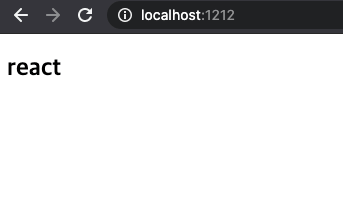

새해부터 이런 기초적인 내용을 왜 쓰기 사작하는가  
작년 중순부터 연말까지 너무 바빴던 것도 있고  
새로운 프로젝트를 시작하면서 정리했던 내용 중 필요한 부분을 콕 찝어서  
정리해두기로 생각했다.  
여기서 Backend 내용은 빠져있다. Backend 는 별도로 다룰 예정.

### Web Project 를 시작하기 위해

생각을 해보자.  
새로운 web project 를 만들려면 다들 가장 먼저 뭘 하는가?  

일단 어떤 내용의 서비스를 만들지 생각하고, 어떤 도구들이 필요한지  
모바일도 지원하는지, Backend 는 어디를 쓸지, App 으로도 출시할지,  
응용프로그램 을 지원할지, 브라우저는 어디까지 지원할지 등둥  
고려해야 할 것이 아주 많고 그에 따라 수많은 도구들이 존재한다.  

내가 이번에 새로운 프로젝트를 시작하며 가장 크게 고려한 것은 필요할 때까지  
사용하지 않는다 였다.  

패키지의 최소 설치는 (= opensource 최소 이용) 번들 사이즈를 줄일 수 있고,  
보안적으로 많은 도움을 준다.  

그리고 오픈소스의 버전관리에서 벗어날 수 있으며,  
필요한 기능은 직접 만들어 쓰기 때문에 개발하는데 조금더 깊이 파고들 수 있다.  

실제 회사에서는 Electron 과 반응형 웹, 그리고 graphql 을 사용하는 프로젝트로 했고,  
이번 예제에서는 단순히 반응형 웹에 초첨을 맞춰본다. 여기서 만약  
더 필요한 지원이 있다면 차차 늘려가면 된다.  
(ex: React Native, Ionic, electron, apollo, relay 등등)

### Init Project

현재 FE 에서 가장 많이 사용되는 툴은 아무래도 React 일 것 이다.  
난 Angular 를 좋아하지만 각각 장단점이 있으니, 그리고 React 를 사용하는 곳이  
훠얼씬 많으니 React 중심으로 얘기한다.  

빈 폴더를 하나 만들고 React 를 설치 해보자.

>`test-project`

test-project 란 폴더를 만들고 먼저 중심이 되는 React 를 설치 해보자.  

잠깐! 여기서 create-reacr-app 으로 땡치려는 사람은 이글을 보지말고  
그냥 하던대로 개발을 계속 하면 된다.  
cra 를 사용할거면 이런 글을 쓸 이유가 없다.  

물론 cra 에는 react 중심기능을 포함하여 test 관련 라이브러리나 webpack 같은  
번들러가 포함되어 있기 때문에 사용하기 편할 수도 있다.  
문제는 강제로 해당 패키지들을 사용해야 한다는 것이다.  
(물론 바꿀수는 있다. 그런데 그럴거면 cra 를 사용할 의미가 있는가)  

처음부터 클린하게 만들다 보면 모르는 것을 볼 수도 있고, 새로운 것을 배울 수도 있다.  
그래서 순수하게 react 설치부터 시작한다.  

만들었던 test-project 에서 npm init 을 사용하여 package json 을 초기화하자.  


### React 설치 

>`yarn add react react-dom`

react 와 react-dom 의 차이는?  
차이라기 보단 react 는 정확히 우리가 알고있는 react 의 기능을 가지고 있는 코어 라이브러리다.  
react를 사용하여 후크, 라이프사이클, compoenet 등을 정의하고 사용할 수 있다.  
react 로 만들어진 요소들을 dom 요소에 붙이기 위해 react-dom 이 필요한 것이다.  
기존에는 둘이 합쳐져 있었지만 react-native 가 등장하며 분리되었다.  

react, react-dom 은 웹앱을 위해 사용하고,
react, react-native 는 모바일 App 을 위해 사용한다.  

자 그럼 react 와 react-dom 을 설치 했으니 끝난 것인가? 아니다.  
우리는 react 로 개발하며 로컬에서 컴포넌트를 디버깅하고 테스트하고 보기 위해  
만들어진 ui 들을 브라우저에서 편하게 볼 수 있도록 해당 코드들을 번들링 하고  
추가로 web server 를 구동하여 편리하게 개발할 수 있는 기능이 필요하다.  


### Bundler 설치

현재 가장 많이 쓰이는 번들링 도구는 Webpack 이다.  
플러그인도 다양하고, 커스텀하게 설정할 수 있고, 다양한 커뮤니티와 많은 프로젝트에서  
사용 중 이다.  

하지만 이 글의 제목이 무엇인가? 클린하게 설치하기다.  
그리고 현재 상황에서 webpack 의 다양한 설정이 필요한가?  
정답은 아니오 이다.  

webpack 에 익숙하다면 webpack 을 사용해도 좋지만 zero configuration 을 지향하는  
parcel 을 고려해보도록 하자.  
parcel 을 특이하게 설정 파일이 없다. (만들수도 있다.)   
자동으로 파일들을 감지해서 번들링하고 dev server 뿐만 아니라 hmr 도 지원한다.  

자세한 내용은 https://ko.parceljs.org/ 여길 참조하자.  
(한글 사이트도 존재한다.)

>`yarn add --dev parcel-bundler`

### Typescript 설치

참고로 저렇게만 설치해도 이제 개발을 시작할 수 있다.  
하지만 현재 fe 개발에 필수로 들어가는 또 하나의 도구가 있다.  
typescript 는 꼭 같이 사용하길 바란다.  
서비스가 커질수록 typescript 의 혜택은 어마어마하다.  

잘 정의된 type 는 그 자체로 가이드 문서가 될 수 있다.  
이는 후에 새로운 멤버가 합류해도 빠르게 적응할 수 있고, 서비스의 안정성을  
한껏 높여준다.

>`yarn add typescript`

추가로 typescript 를 사용하기 위해서는 @types 라는 추가 패키지를 설치 해야 한다.  
이 @types 에는 일반 js 파일로 만들어진 라이브러리들의 타입을 추론하기 위해  
해당 기능들의 type 이 정의 되어있다.  

유명한 오픈소스 라이브러리는 typescript 지원을 위해 자체적으로 type 이 내장된  
보조 패키지가 존재한다. (없으면 직접 만들어야 한다!)  

react 와 react-dom 의 기능을 typescript 에서 사용하기 위해 보조 라이브러리를  
추가해보자.

>`yarn add --dev @types/react @types/react-dom`

마지막으로 typescript 를 사용하기 위한 설정파일을 만들어주자.  
typescript 의 설정파일은 tsconfig.json 이란 이름으로 지정되어 있으며  
우리의 root 디렉터리에 만들어 주면 된다.

>`test-project/tsconfig.json`

```json
{
  "compilerOptions": {
    "target": "ES6",
    "module": "commonjs",
    "allowJs": true,
    "jsx": "react",
    "sourceMap": true,
    "outDir": "./dist",
    "strict": true,
    "noImplicitAny": true,
    "esModuleInterop": true,
  },
  "include": [
    "src/**/*",
    "*.d.ts"
  ],
  "exclude": [
    "./node_modules"
  ]
}
```

해당 설정에 관해서는  
https://typescript-kr.github.io/pages/tsconfig.json.html  
여기서 살펴 볼 수 있다. 간단한 설정이니 모른다면 꼭 읽어보자.  


### Router 패키지 설치

웹앱에서 Router 설정은 중요하다.  
여기선 대놓고 공식적으로 사용하라는 react-router 라는 패키지가 존재한다.  
중요한건 얘네들은 react react-dom 쌍처럼 존재하는게 아닌  
각자가 독립적으로 존재한다.  

react-router - 웹, 모바일  
react-router-dom - 웹  
react-router-native - 모바일  

지금은 웹앱 프로젝트에 사용 중이니 react-router-dom 을 설치 하면 된다.  

>`yarn add react-router-dom`

>`yarn add --dev @types/react-router-dom`

### Dependencies

여기서 한가지 의문이 있을수도 있다.  
패키지를 설치 할 때 무엇을 기준으로 dependencies 정의하는가?  
dev dependencies 는 말그대로 내가 개발할 때 필요한 의존성이다.  
bunlder 나 test 프레임워크들 또는 dev server 를 구동하는 패키지들.  
이들은 내가 개발할때 필요한 패키지이고, 실제 제품에서는 필요 없는 것 들이다.  

그리고 production 으로 빌드할 때 dev 패키지들은 포함되지 않는다.  

<strong>실제로 우리는 번들링 해서 사용하고 웹서비스에만 제공하므로 저둘을 딱히 구분 할 필요는 없다.</strong>

단지 의미론적으로 구분 할 뿐 크게 신경쓰지 말라는 것 이다.  
다만 오픈소스와 패키지 기능을 만들때는 해당 기능을 구분 하는 것이 좋다.  
굳이 런타임에서 필요없는 패키지를 넣어서 기능을 크게 만들 필요는 없다.  


### index.html

자 지금까지 설치한 부분을 살펴보자.  

```json
{
  "name": "test-project",
  "version": "0.0.1",
  "description": "test-project",
  "dependencies": {
    "react": "^17.0.1",
    "react-dom": "^17.0.1",
    "react-router-dom": "^5.2.0",
    "typescript": "^4.1.3"
  },
  "devDependencies": {
    "@types/react": "^17.0.0",
    "@types/react-dom": "^17.0.0",
    "@types/react-router-dom": "^5.1.7",
    "parcel-bundler": "^1.12.4"
  }
}
```


src 폴더를 만들고 index.html 파일을 만든 뒤 react 로 만든 컴포넌트 들이  
들어 갈 수 있도록 초기 페이지를 만들자.  

>`test-project/src/index.html`

```html
<!DOCTYPE html>
<html lang="ko">

<head>
  <title>TestProject</title>
  <meta http-equiv="Content-Type" content="text/html; charset=utf-8" charset="utf-8" />
</head>

<body>
  <div id="app"></div>
  <script src="index.tsx"></script>
</body>

</html>
```

>`test-project/src/index.tsx`

```javascript
import React from 'react';
import ReactDom from 'react-dom';
import App from './app';

ReactDom.render(<App />, document.getElementById('app'));

```

index.html 과 react 를 연결해주는 index.tsx 을 만들었다면  
이제 시작 파일인 App 을 만들어보자.  

```javascript
import React from 'react';

const App: React.FC = () => {
  return (
    <div>
      <h2>react</h2>
    </div>
  )
}
export default App;
```

자 이제 준비는 다 되었다.  


### start & build

이제 실제 실행하여 개발을 헤보자.  
package.json 에 실행 명령과 빌드 명령을 추가하자.  

```json
{
  ...
  "scripts": {
    "start:dev": "parcel -p 1212 ./src/index.html",
    "build:dev": "parcel build ./src/index.html --public-url ./ --out-dir build/output --no-source-maps"
  }
}
```

parcel 명령어는 매우 심플하다.  
해당 명령어로 시작 할 경우 자동으로 hmr 지원도 추가된다.

>`yarn start:dev`

를 실행하고 http://localhost:1212 에 접속하면 react 라는 우리가 만든  
글자가 나타난다.



추가로 build 명령어를 실행해서 실제로 빌드가 잘 되는지 보자.  
build 명령어의 옵션을 보면  

<strong>--out-dir</strong> 은 빌드된 파일을 어디에 저장할 지 나타내는 부분이고  
<strong>--no-source-map</strong> 은 말그대로 소스맵을 생성하지 말라는 옵션이다.  
그리고 <strong>--public-url 옵션에</strong> ./ 을 줬는데 이는 빌드된 index 파일에서  
js 파일을 불러올때 base 경로를 지정 해 주는 옵션이다.  

기본적으로 빌드했을대는 주소가 /src.133131.js 이런식으로 붙게 되는데  
이는 해당 프로젝트의 루트폴더를 의미하게 된다.  

우리는 루트 폴더가 아닌 별도의 폴더에 저장하게 되고 추가로 index 파일과  
번들파일은 같은 폴더에 위치하고 있기 때문에 base 경로를 현재 index 파일이  
존재하는 경로로 맞춰주는 것 이다.  

이제 빌드 명령어를 실행하고 실제로 빌드된 파일을 열어보자.  

>`test-project/build/output/index.html`


똑같이 나올 것이다. (사실 스크린샷은 찍기 귀찮아서 재탕임..)  

이로써 기본적인 개발 환경설정은 끝났다.  
이제 본인이 필요한 test 프레임워크, 백엔드와 연결 할 패키지, 스타일 관련 등
필요한 부분만 설치해서 사용하면 된다.  

### 추가 의문점

Babel 은 사용안하나요?  
parcel 번들러에는 필수 babel preset plugin 이 포함되어 있다.  
(env, flow, react, typescript)  

그러므로 추가적인 preset 이 필요 없는 한 별도로 babel 을 설치 할 필요는 없다.  

<strong>참고로 async await 를 사용 하기 위해서는 별도 plugin 을 사용해야 한다.</strong>

사용하는 방법은 @babel/runtime 과 @babel/babel-plugin-transform-runtime  
을 설치하면 된다.

babel 설정 파일을 사용한다면 parcel 은 자동으로 해당 설정 파일을 읽어서  
빌드하기 떄문에 위 플러그인 설치 후 .babelrc 파일을 생성하여  
해당 plugin 을 지정해 주면 사용 가능하다.  

자세한 내용은 
https://ko.parceljs.org/code_splitting.html  
요기를 참조하자.

### 마무리

간단하게 web project 를 시작하는 방법을 적었지만, 빠진 부분이 많다.  
global style 설정이나 스타일 관련 부분이나 이런부분은 본인이 원하는 방향으로  
지정해서 사용하길 바란다.  
사실 오늘 적은 부분은 빙산의 일각이다.

그리고 프로젝트 폴더 구조나 상태관리나 이런 세세한 부분은 정답은 없지만  
시간이 되면 아마 더 추가할지도..  