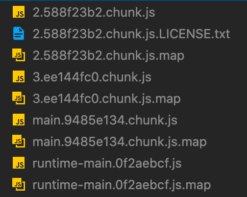
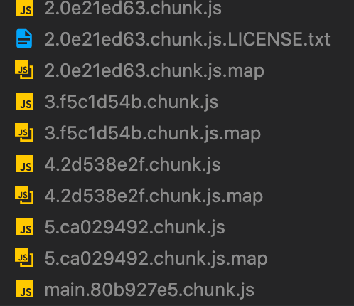
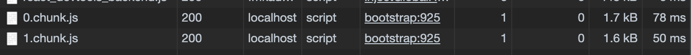
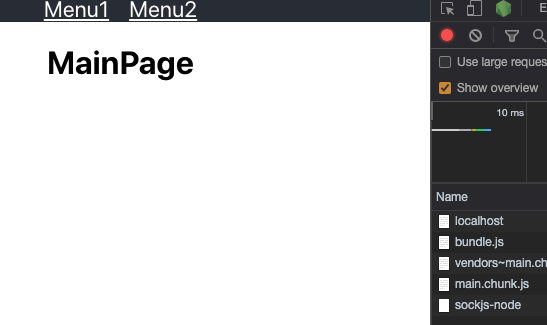
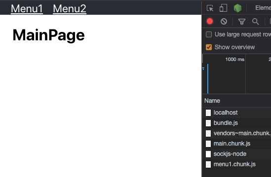

우리의 서비스가 커져갈때 마다 js 파일의 용량은 커져간다.  
특히나 별도의 폰트, 이미지와 같은 리소스가 포함되어 있을 경우 사용자가 처음 접속 했을때 받아야 하는 데이터 양은 점점 부담스러워 질 것이다.

아무리 5g 시대(일단은 겉보기라도..) 가 오고 있다고 해도 모든 사용자가 초고속 인터넷을  
사용하진 않는다. 그리고 사용자의 주위환경에 의해 인터넷 속도는 매우 변동적이다.

이런 다양한 인터넷 환경에 대처하여 사용자에게 최대한 빠른 응답을 줄수 있는 최적화 방법이 무엇이 있을까?

여러가지 최적화 전략이 있겠지만 그중 가장 오늘은 lazyload 와 preload 를 이용한  
사이트 최적화 방법을 다뤄보자,

### Lazyload

Lazyload 는 말그대로 불러오는 행동을 지연시키는 것이다.  
왜 지연시켜야 할까?

우리가 사용하는 서비스, 예를 들어 요새 핫한 쿠팡에 접속했다고 생각해보자.  
쿠팡의 메인화면이 당신을 반겨 줄 것이다. 메인화면에는 수많은 카테고리와 이벤트,  
광고 페이지로 가득 차있다.

하지만 사용자가 보는 메인 화면에서 해당 이벤트의 자세한 내용을 볼 수 있을가?  
배너에 떠 있는 상품의 자세한 내용을 볼 수 있을까?  
광고를 클릭하기 전 해당 광고의 내용을 볼 수 있을까?

우리는 해당 내용을 클릭하기 전까지는 그 자세한 내용을 볼 수 없다.  
여기서 굳이 사용자가 해당 이벤트 또는 상품, 광고를 클릭하기 전 해당 내용들을 전부  
다운로드 받아야 할 이유가 있을까?

만약 그렇게 된다면 글쎄 쿠팡의 배송만 로켓이 되어버리는 사태가 일어날 수 있다.  
사용자는 내부적으로, 또는 통신적으로 해당 사이트가 어떻게 돌아가는지 반드시 알아야 할  
이유도 없고 알고 싶지도 않을 것이다.  
그냥 화면이 빠르게 나오고 빠르게 반응하면 그걸로 된 거다.

결론적으로 우리는 접속 했을때 메인화면에서 필요한 기능을 포함한 데이터 외에는 굳이  
다른 모든 데이터를 다운로드하며 사이트의 속도를 느리게 만들 필요가 없는 것 이다.

이때 등장하는 개념이 lazyload 이다.  
사용자가 필요로 할때까지 해당 데이터의 다운로드를 보류하여 반응속도를 높이는 것이다.

lazyload 를 적용하기 전 먼저 선행되어야 할 것이 있다.  
최신 모던 웹 서비스는 webpack, parcel 등의 bundler 를 사용하여 실제 제품버전으로  
배포하기 전 작성한 js 코드를 하나로 묶는 번들링을 실행하게 된다.

lazyload 는 사용자가 필요할때 데이터를 다운로드 받는다고 했다.  
그렇다면 그전에 특정 기준으로 코드를 잘라 번들링이 실행 될때 여러개의 번들링된 js 파일로 만들어 둬야 하지 않을까?

그러기 위해 code splitting (코드분할) 을 먼저 적용한다.

### Code Splitting

위에서 말한대로 Code Splitting 을 실행하기 위해 현재 가장 많이 쓰이는  
webpack 기준으로 설명을 할텐데, 아마 다른 bundler 들도 동일하게 작동 할 거라  
예상된다.

splitting 의 기준이 되는 부분을 정할 때 별도의 모듈이나 계산적으로 큰 함수 등  
개발자가 적절히 기준을 정할 수 있지만, 사실 기능별로 lazy 하기엔 기준이 굉장히  
애매할 수 있다.

가장 좋은 방법은 Route Page 별로 분할 하는 것이다. 아마 대부분 특수한 경우가 아니고는 page 별 분할을 사용하는 중일 것이다.

### Dynamic Import

```javascript
import SomeModule from "./someModule"
```

우리는 기본적으로 위와 같이 대부분 정적으로 module 을 가져 왔을 것 이다.
lazy 하다는 건 내가 필요할 때 해당 데이터를 가져와야 하기 때문에 우리는 import 를 동적으로 가져 올 것 이다.

dynamic import 는

```javascript
import("./somePage").then(page => {
  page.default()
})
```

위와같이 import 사용 시 promise 를 반환한다. 고로

```javascript
const somePage = await import("./somePage")

somePage.default()
```

위처럼 async/await 를 사용하여 사용이 가능하다.
dynamic import 를 이용하면 자동적으로 bundler 에서 해당 항목을 분할하게 된다.  
여기서 react 에서는 import 된 컴포넌트를 동적으로 렌더링 가능케 해주는  
Lazy 와 Suspense 가 존재한다.  
이를 이용하여 실제 React 에서 page 별 코드 분할을 해보자.

### Lazy, Suspense

Lazy 를 이용하여 import 된 컴포넌트를 동적으로 렌더링 하게 되는데,  
여기서 lazy 로 가져오는 모듈은 반드시 suspense 아래에 위치해야 한다.  
suspense 는 lazy 된 모듈들이 전부 불러오기까지 필요한 loading 화면등을 제공하는 것도 가능하다.

실제로 기본적인 page를 가진 정말 정말 간단한 앱을 만들어보자.

```javascript
import "./App.css"
import { 
  BrowserRouter as Router,
  Switch,
  Route,
  Link 
} from "react-router-dom"
import { MainPage, Menu1Page, Menu2Page } from "./pages"
import React from "react"

function App() {
  return (
    <Router>
      <div className="App">
        <header className="App-header">
          <Link to="/menu1">Menu1</Link>
          <Link to="/menu2">Menu2</Link>
        </header>
        <Switch>
          <Route path="/menu1" component={Menu1Page} />
          <Route path="/menu2" component={Menu2Page} />
          <Route path="/">
            <MainPage />
          </Route>
        </Switch>
      </div>
    </Router>
  )
}

export default App
```

참고로 react 에서 lazy 를 사용할때는 default 만 지원한다.  
이를 named export 시키고 싶다면 별도 파일을 만들어서 로드해야 한다.  
자세한건  
https://ko.reactjs.org/docs/code-splitting.html  
위를 참고하자.

code splitting 이 되지 않은 순수한 페이지 이다.  
해당 코드의 제품을 빌드 해보자. bundle 파일은 어떻게 될까?



몇개의 파일로 번들링이 되어있는지 확인 할 수 있다.  
여기서 메뉴1이나 메뉴2로 라우팅을 변경해도 추가로 다운로드 되는 건 없다.  
이미 해당 메뉴 페이지에 관한 정보는 모두 다운로드 받았기 때문이다.

지금은 서비스의 크기가 작으니 문제가 전혀 없지만 서비스가 커지고 외부 라이브러리들이  
점점 포함되기 시작하면 bundle 의 크기가 커질 것이고  
이는 추후 초기 페이지로드가 점점 느려지게 될 것이다.  
그리고 거기에 포함되는 리소스들까지 더한다면..

자 그럼 이제 lazyload 를 한번 적용 해보자.

### Lazyload 적용

```javascript
import "./App.css"
import { 
  BrowserRouter as Router,
  Switch,
  Route,
  Link 
} from "react-router-dom"
import { MainPage } from "./pages"
import React from "react"

const menu1 = React.lazy(() => import("./pages/lazy/menu1"))
const menu2 = React.lazy(() => import("./pages/lazy/menu2"))

function App() {
  return (
    <Router>
      <div className="App">
        <header className="App-header">
          <Link to="/menu1">Menu1</Link>
          <Link to="/menu2">Menu2</Link>
        </header>
        <React.Suspense fallback={"loading"}>
          <Switch>
            <Route path="/menu1" component={menu1} />
            <Route path="/menu2" component={menu2} />
            <Route path="/">
              <MainPage />
            </Route>
          </Switch>
        </React.Suspense>
      </div>
    </Router>
  )
}

export default App
```

React 의 Lazy 와 suspense 를 적용하면 이제 menu1 과 menu2 의 번들은  
별도로 분리된다. 이 상태에서 한번 빌드를 해보자.



여러개의 chunk 로 나뉘어진 것을 볼 수가 있다.  
이제 실제로 mainPage 에서 menu1 과 menu2 를 들어가 보면



해당 메뉴에 들어갈때 데이터를 받는 것을 확인 할 수 있다.  
이제 Route 기준으로 Lazyload 를 구현 했으니 초기 페이지에서는 필요한 부분만  
다운로드 받고 사용자가 다른 페이지로 이동할때 필요한 데이터를 받을 것이다.  

초기페이지의 최적화는 끝냈다. 하지만 여기서 또 중요한 문제가 있다.  
lazy load 로 진행했을때 페이지에 접속 할때마다 우리는 또 데이터의 다운로드를  
기다려야 한다.

짧은 시간이지만 이 또한 서비스의 사용성을 해칠 수 있다.  
만약 초기데이터를 다운로드 받고, 초기 페이지를 나타낸 뒤  
사용자가 다른 페이지로 접근 전에 백그라운드에서 미리 페이지 데이터를 받을 수 있다면  
서비스 사용에 더욱 좋지 않을까?

여기서 preload 가 적용된다.

### Preload

lazyload 가 적용된 뒤, 사용자가 해당 페이지에 접근 하기 전  
미리 데이터를 받아서 TTI (Time to Interactive) 까지의 시간을 줄여보자.

Route 가 변경되기 전 미리 데이터를 받아오려면 (뷰를 보여주려면) 해당 페이지 데이터의  
chunk 에서 메서드를 실행해야 한다.  

react lazy 에서는 내부 메소드를 실행시킬 기능이 없다. 우리는 임의로 해당 기능을  
넣어줘야 할 것이다.

react lazy 는

```javascript
  React.lazy(() => Promise<{default: MyComponent}>)
```

위처럼 Promise 를 반환합니다.  
suspense 는 위에서 말했듯이 lazy 된 컴포넌트를 불러오며 해당 promise 가  
실행될때까지 유지 시키고 응답에 따라 메서드를 실행시키는 역활을 한다.

여기서 preload 를 적용하려면 단순히 해당 promise 를 먼저 실행시켜 버리면 된다.  
먼저 import 를 선언하고 해당 component 를 app 이 실행될때 실행해보자.

```javascript
import "./App.css"
import { 
  BrowserRouter as Router,
  Switch,
  Route,
  Link 
} from "react-router-dom"
import { MainPage } from "./pages"
import React, { useEffect } from "react"

const menu1 = import("./pages/lazy/menu1")
const menu2 = import("./pages/lazy/menu2")

function App() {
  const preloadMenu1 = React.lazy(() => menu1)
  const preloadMenu2 = React.lazy(() => menu2)

  return (
    <Router>
      <div className="App">
        <header className="App-header">
          <Link to="/menu1">Menu1</Link>
          <Link to="/menu2">Menu2</Link>
        </header>
        <React.Suspense fallback={"loading"}>
          <Switch>
            <Route path="/menu1" component={preloadMenu1} />
            <Route path="/menu2" component={preloadMenu2} />
            <Route path="/">
              <MainPage />
            </Route>
          </Switch>
        </React.Suspense>
      </div>
    </Router>
  )
}

export default App
```

이렇게 하면 처음 진입시 main page 를 로드하고, route 가 변경되지 않아도  
추가로 menu1, menu2 의 chunk 파일을 미리 가져온다.

첫 페이지 진입 TTI 는 빨리지고, 추가로 다른 페이지를 들어갈 때 preload 한 데이터로  
인하여 접속이 더 빨라 질 것이다.

여기까지만 하면 어느정도 최적화는 완료되었다.  
하지만 추가로 한가지 더 생각해보자.  
만약 사용자가 해당 서비스의 모든 페이지를 탐색 할 생각이 없다면?  
굳이 모든 페이지의 데이터를 미리 받을 이유는 없을 것 이다.  
이는 사용자의 데이터 소모량만 늘리는 일이 된다.

그래서 우리는 Router 에 한가지 장치를 더할 것 이다. 해당 링크를 가려고 할때  
미리 preload 시키는 전략이다.

### preload with router

React router 에는 match path 라는 유틸함수가 존재한다.  
이는 주어진 경로와 일치하는 route 가 존재한다면 해당 컴포넌트를 반환하게 된다.

그럼 Link 에 사용자가 hover 했을때 해당 Link 의 route 와 현재 설정 되어있는  
Route 들을 비교하여 일치하는 Component 를 찾은 뒤  
아까 했던 것 처럼 promise 를 실행시켜 버리면  
사용자가 진입하고자 하는 페이지만 미리 로드 할 수 있을 것이다.

그럼 일단 현재 Route 들의 정보를 모아두기 위해 코드를 조금 변경하자.  
각 route 에는 preload 를 위한 추가 import state 를 따로 저장해둔다.

우리는 매칭되는 컴포넌트를 찾아지면 각 route 에 맞는 import 를 실행시킬 것이다.

```javascript
type importStateType = {
  importState?: () => any,
}

const menu1 = {
  importState: () => import("./pages/lazy/menu1"),
  lazy: lazy(() => import("./pages/lazy/menu1")),
}

const menu2 = {
  importState: () => import("./pages/lazy/menu2"),
  lazy: lazy(() => import("./pages/lazy/menu2")),
}

const routes: Array<RouteProps & importStateType> = [
  { path: "/", exact: true, component: MainPage },
  {
    path: "/menu1",
    exact: true,
    component: menu1.lazy,
    importState: menu1.importState,
  },
  {
    path: "/menu2",
    exact: true,
    component: menu2.lazy,
    importState: menu2.importState,
  },
]
```

importState 는 preload 를 위해 추가된 항목이다.  
이제 추가로 matching 되는 컴포넌트를 찾는 함수를 정의하자.

```javascript
const findRouteComponent = (
  routes: Array<RouteProps & importStateType>,
  path: string
) => {
  const matchComponent = routes.find(route =>
    matchPath(path, {
      path: route.path,
      exact: route.exact,
    })
  )

  return matchComponent ? matchComponent : null
}
```

routes 배열과 link 의 path 를 받아서 일치하는 컴포넌트를 받아서 반환한다.  
이는 곧 우리가 지정한 lazy component 가 될것이다.  
이제 반환받은 lazy component 를 이전과 같이 실행시켜주면 된다.

반환된 컴포넌트를 preload 시키는 함수를 만들어보자.

```javascript
const preloadComponent = (path: string) => {
  const cmp = findRouteComponent(routes, path)
  if (cmp && cmp.importState) {
    cmp.importState()
  }
}
```

해당 함수는 우리가 설정해둔 import state 를 실행하여 해당 컴포넌트를 미리 import 하게 된다.

자 이제 마지막으로 Link 컴포넌트에 mouse hover 시 위 함수를 실행하도록 만들자.

```javascript
const LinkWithPreload = ({
  to,
  ...props
}: {
  to: string,
  children?: ReactNode,
}) => {
  return <Link to={to} onMouseEnter={() => preloadComponent(to)} {...props} />
}
```

준비는 다 되었다.  
전체코드는 아래와 같다.

```javascript
import './App.css';
import { 
  BrowserRouter as Router,
  Switch,
  Route,
  Link 
} from "react-router-dom"
import { MainPage } from './pages';
import React, { lazy, ReactNode } from 'react';

type importStateType = {
  importState?: () => any
}

const menu1 = {
  importState: () => import(
    /* webpackChunkName: "menu1" */
  './pages/lazy/menu1'
  ),
  lazy: lazy(() => import(
    /* webpackChunkName: "menu1" */
    './pages/lazy/menu1')
  ),
};

const menu2 = {
  importState: () => import(
    /* webpackChunkName: "menu2" */
    './pages/lazy/menu2'
   ),
  lazy: lazy(() => import(
    /* webpackChunkName: "menu2" */
    './pages/lazy/menu2'
   ),
  ),
};

const routes: Array<RouteProps & importStateType>  = [
  { path: '/', exact: true, component: MainPage },
  { path: '/menu1',
    exact: true,
    component: menu1.lazy,
    importState: menu1.importState 
  },
  { path: '/menu2',
    exact: true,
    component: menu2.lazy,
    importState: menu2.importState 
  },
]

const findRouteComponent = (
  routes: Array<RouteProps & importStateType>,
  path: string
) => {
  const matchComponent = routes.find((route) => matchPath(path, {
    path: route.path,
    exact: route.exact,
  }));

  return matchComponent ? matchComponent : null;
}

const preloadComponent = (path: string) => {
  const cmp = findRouteComponent(routes, path);
  if (cmp && cmp.importState) {
    cmp.importState();
  }
}

const LinkWithPreload = ({ to, ...props }: { to: string, children?: ReactNode }) => {
  return (
    <Link
      to={to}
      onMouseEnter={() => preloadComponent(to)}
      {...props}
    />
  )
}

function App() {

  return (
    <Router>
      <div className="App">
        <header className="App-header">
          <LinkWithPreload to="/menu1">Menu1</LinkWithPreload>
          <LinkWithPreload to="/menu2">Menu2</LinkWithPreload>
        </header>
        <React.Suspense fallback={'loading'}>
          <Switch>
            {routes.map((route) =>
              <Route
                key={route.path as string}
                component={route.component}
                path={route.path}
                exact={route.exact}
              />
            )}
          </Switch>
        </React.Suspense>
      </div>
    </Router>
  );
}

export default App;

```

초기 mainPage 진입시 network 를 보자.



main.chunk.js 파일만 로드 된 걸 볼수 있다.  
여기서 마우스로 menu link 를 hover 하게 되면 해당 페이지의 chunk 파일을  
미리 가져오게 된다.  
(menu1.chunk.js)



방법이 생겼으니 위 코드 들을 더 편하고 재사용 가능하도록 만들어 보자.  
또 한가지 중요한건 해당 사항들은 SSR 에는 적용되지 않는다.  
정확히는 lazy 와 suspense 는 아직 SSR 을 지원하지 않는다.  
SSR 을 사용할때는 Loadable Component Package 를 사용하도록 권장하고 있다.

그럼 끝
