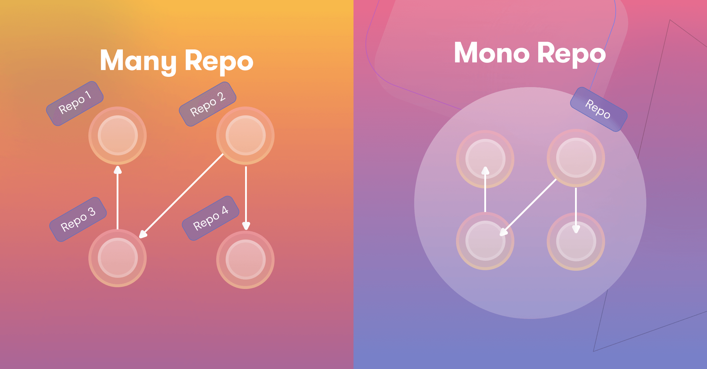
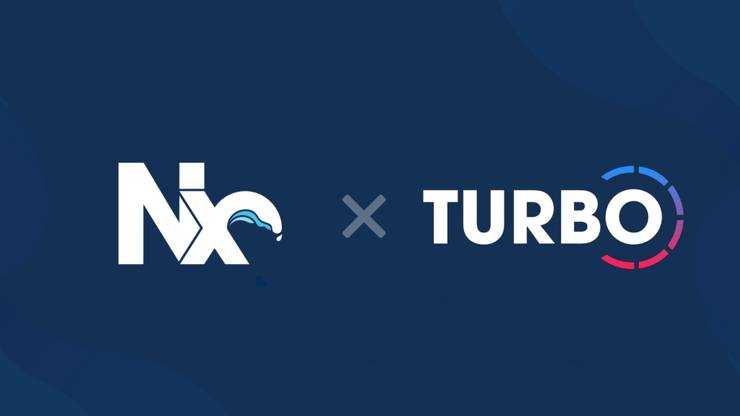
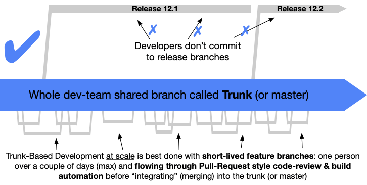

이번에 회사에서 진행하던 프로젝트를 기존 모놀리식 에서 MFE 로 전환 하였다.  
현재는 stable 한 상태가 되었기에 간단하게 프로젝트를 전환 할때의 경험과  
필요한 부분을 적어본다.

이 글은 `react` 와 `webpack` 을 이용한다는 가정하에 작성한다.  
사실 다른 라이브러리도 크게 다르진 않을 것이다.  
다만 `module federation` 을 지원하지 않는 번들러 라면  
차이가 있을 수 있다.

## 일단 전환을 해야 할까?

가장 먼저 생각해야 할 부분은 현재 프로젝트를 개발하면서 어떤 불편함이 있는지  
먼저 생각해야 한다.

현재 체계적으로 리뷰가 이루어지고, 컨벤션이 명확하며 CI/CD 를 구성하는데 있어서  
큰 불편함이 없다고 생각 된다면, 굳이? 라고 말하고 싶다.

왜냐하면 전환을 하기 위한 비용이 생각보다 많이 든다.  
CI/CD 구축에 있어서 많은 시행착오가 있을수도 있다.  
그리고 많이 복잡하며, 변경된 개발 방식이 낯설수도 있다.

경험이 많은 구성원들이 많을수록 그나마 유리하며, 해당 방식에 익숙하지 않다면  
반발이 있을수도 있다. (팀원들을 설득해야 한다.)  
그 모든것을 감당하고 시간적 여유까지 있다면 전환 할 가치는 충분하다고 본다.

본인은 현재 진행중인 프로젝트가 너무 커지고, 팀은 시니어가 부족한 상태 였으며  
빌드에 많은 시간이 소요되고, 동시에 너무 많은 기능개발이 시작되면서  
코드 병합에도 불편함을 느끼는 상태였다.

시니어가 부족하다는 점 빼고는 전환 할 이유가 충분했다.  
지금이 아니면 일정에 치여서 계속 늦춰질 것 같았다.  
귀찮다고 힘들다고 현재에 만족하면 안된다.

## monorepo

MFE 의 목적은 한덩어리로 뭉쳐진 개발코드를 별도의 module 또는 package 로  
분리하여 독립적으로 개발하도록 하는 것 이다.

이렇게 되면 각각의 모듈은 빌드와 테스트, 개발에 있어서 완전히 독립적으로 진행되고  
모듈 간의 의존성이 아주 얕아지기 때문에 충돌이 현저히 줄어든다.

변경된 모듈의 빌드와 배포만 이루어지기 때문에,  
한덩어리로 개발 할때와는 다르게 빌드,배포,TEST 등의 시간이 현저히 줄어든다.  
내가 조그만 부분을 변경한다고 현재 프로젝트 전체를 다시 빌드 할 필요가 없는 것이다.

여기서 monorepo 를 추천하는 이유는 공유 모듈과 설정을 사용하기 쉽고,  
각각의 모듈을 한눈에 보기 편하다.

아무리 모듈을 독립적으로 개발한다고 해도 분명히 공유해야 할 기능, 디자인,  
assets, 그리고 각종 type, gql 을 사용한다면 fragment, schema 등  
shared 한 부분이 생각보다 상당히 많다.

그리고 monorepo 를 적극적으로 추천하는 또 한가지 큰 이유는 버전 관리 때문이다.  
각각의 모듈은 각자의 package.json 즉 패키지 관리자를 가지고 있다.  
여기서 어떤 모듈은 react v17 을 쓰고 어디는 react v18 을 쓰고 있다면?  
만약 버전을 최신 버전으로 모두 올려주고 싶다면 모든 모듈에서 update 를 진행해야 한다?

그러고 싶은 개발자는 없으리라 본다.  
monorepo 가 정상적으로 돌아가기 위해선 package 의 버전 불일치를 해결하고,  
`single version policy` 를 최대한 준수 해야 한다.

monorepo 의 루트 에서 모든 모듈이 공통으로 사용하는 패키지를 정의하고,  
그 외엔 각각이 모듈이 각자 필요한 package 를 설치하면 된다.

버전 불일치에 대한 걱정을 덜어내고, 그외 eslint, prettier, tsconig 등  
개발 시 필요한 설정을 모든 모듈이 같은 규칙을 사용하도록 쉽게 공유 할 수 있다.  
monorepo 를 택하지 않을 이유가 없다.

monorepo 로 전환하기로 결정했다면 일단 기존의 npm, yarn 은 버리고  
pnpm 으로 이동하는 걸 추천한다.  
yarn berry pnp 는 아직 불안정하기 때문에 현재로선 추천하지 않는다.
만약 본인이 고통을 즐기고 싶다면 도전해보면 된다.

## Module federation

각각의 Module 을 개발한 뒤 host app 에서 이들을 workspace 형식으로  
설치해서 개발 할 수 있다.  
그렇게 해도 되지만 그러기엔 굉장히 불편한 점이 있다.

monorepo 로 인해 각각의 모듈을 충돌없이 각자 개발할 수 있도록 변경했다.  
하지만 내가 개발한 모듈을 host app 에서 적용 시키기 위해서는?

**개발은 각각의 모듈이 따로 개발되지만, 실제로 변경사항이  
host app에 적용되려면 host를 또 다시 빌드를 해줘야 한다.**

여기서 host 를 다시 빌드 하지 않고, 변경된 모듈이 자동으로 적용될 수 있다면?  
host 가 런타임일때 동적으로 변경된 모듈만 알아서 적용할 수 있도록 해주는 기능이  
Module federation 이다.

변경된 모듈만 빌드하고, 배포하고 적용하고 host 는 실시간으로 이런 변경사항을  
가져올 수 있다.  
module federation 은 webpack 에서 유명한 기능으로 알고 있지만,  
vite.js 에서도 이를 지원하며, 심지어 서로 호환도 가능하다.

## Nx, Turborepo

monorepo 와 module federation 을 적용한다면 이제 각각의 모듈을  
독립적으로 개발할 준비가 되었다.  
오 이제 체계적으로 모듈을 독립적으로 개발하고 빌드하고 배포하고 해피합니다 라고  
말하기에는 아직 넘어야 할 산이 있다.

그래서 빌드와 배포는 어떻게 할 것인가?  
만약 모듈 A, 모둘 B, host 모듈 이렇게 3개의 모듈이 있을때  
모듈 A 를 수정하고 빌드, 배포를 하고 싶다고 한다면 CI 를 어떻게 구축해야 할까?

아니 그전에 CI 에서 내가 모듈 A만 변경했어요 라고 알수 있을까?  
모듈별로 ci 를 만들어야 할까 아니면 커밋 메시지나 태그등 별도의 표시로  
해당 모듈만 빌드하고 배포 할수 있도록 해야하나?

다 불완전하고 좋지 않은 방법이다.  
우리가 원하는 방법은 간단한 명령어만으로 특정 모듈의 변경을 감지하고  
해당 모듈에 대해서만 명령을 실행하고  
추가로 변경되지 않은 모듈은 빌드된 파일을 미리 캐시 해두고  
불러올 수 있으면 좋을 것 같다.

저런게 어딨냐고 할수 있겠지만, 이미 해당 기능을 장착한 라이브러리가 존재한다.  
그 중 유명한 2개가 바로 Nx 와 Turborepo 이다.

이 라이브러리들은 위에서 말한 기능을 전부 지원한다.  
추가로 remote cache 까지 해주기 때문에 내가 어느 pc에서 작업한다고 해도  
이전에 빌드 된 모듈이라면 빌드 된 파일을 아주 빠르게 불러올 수 있다.

자세한 설정을 적기엔 너무 길기때문에 해당 도구들의 홈페이지에서 직접 살펴 보길 바란다.

## MFE 환경 구축 완성?

이제 큰 틀은 잡혔다.  
monorepo 로 손쉬운 버전관리와 공유모듈을 쉽게 사용할 수 있고,  
module federation 이 합쳐지면서 모듈이 독립적으로 빌드,배포 되면서  
작동 할 수 있도록 전환되었고,  
turborepo, nx 로 ci 구축 시 변경된 모듈에서만 원하는 명령을 실행 할 수 있다.

사실 말로는 쉽게 적었지만 위 환경을 구축하는데 수많은 시행착오가 있을 것이다.  
env 의 설정과 각각 다른 stage 환경에 관한 배포 방법, 공유 모듈과 설정의 사용,  
그리고 ci/cd 를 설정 할때 어떤 규칙을 적용할 것인지 등등

이 수많은 문제는 팀원들과 충분히 논의하고 연구하여 각자의 팀에 맞는 환경을 구축하길 빈다.

그럼 여기서 보너스로 사실 이정도 환경만 구축 해두어도 기본적인 MFE 환경을
사용하는데 크게 무리는 없을 것이다.

여기서 MFE 구축과 같이 추천하는 전략이 있는데 바로 `TBD` 이다.

## trunk based development

들어본 사람도 있겠지만 google 에서 한다는 그 TBD 이다.  
간단하게 별도의 기능 브랜치 생성이 아닌 하나의 main repo 로 운영하는 방법이다.  
그리고 그 main repo 는 언제든지 릴리즈 할 준비가 되어 있어야 한다.

TBD 운영에 있어서는 많은 원칙이 있지만  
main 이 아닌 branch 의 수명이 짧아야 하고,  
내가 개발중인 기능을 작게 조각내어 커밋을 자주 해야 한다.

짧은 주기의 커밋은 컨플릭트의 발생을 없애고, 타 팀원들이 내 코드를  
리뷰하기 쉬우며, 코드 실수의 위험성을 줄일 수 있다.

그외 자세한 원칙은 [TBD](https://trunkbaseddevelopment.com/) 여기서 확인해보자.  
구글이 직접 적은 메뉴얼이다.

그리고 언제든지 release 가 가능하도록 main repo 를 유지 해야 한다는게 가장  
중요한데 이를 위해서는 현재 개발중인 기능과 배포 할 기능을 분리 할 필요가 있다.  
그걸 위한 기능이 `feature flag` 이다.

말그대로 flag 를 이용하여 배포할 때 개발중인 기능을 숨기고 배포 할수 있도록 한다.  
당연히 feature flag 를 운영에도 많은 원칙이 있다.  
해당 부분도 위 TBD 메뉴얼에 있으니 꼭 함께 보길 추천한다.

## 모든 부분을 통과했다면?

축하한다. 이제는 빠른 CI/CD 와 더불어 컨플릭트 지옥에서 벗어나고,  
각 모듈의 독립적인 개발로 충돌이 사라지고,  
원하는대로 프로젝트를 안전하게 확장 할수있다.

이상적으로 잘 진행되면 좋겠지만 여기서 내가 구축하며 생긴 의문들을 정리해본다.

- 각 모듈별로 다른 fe 프레임워크를 사용가능한가?

  > **가능하다. 하지만 추천하지 않는다. 꼭 써야하는 상황에서만 추천한다.**

- 공유 모듈은 federation 으로 하는게 좋을까? 아니면 workspace 방식이 좋을까?

  > **이건 환경에 따라 다르지만, 개인적으로 디자인 시스템과 같은 공유 모듈은 workspace 방식으로 하는게 안정적이다. (자주 변경되지 않으니)**

- module 을 나누는 기준은 어떻게 되야 할까? page? 도메인? 기능?
  > **이부분은 정확히 vertical 로 나눌지 horizontal 방식으로 할지 팀에서**  
  > **충분히 의논하고 결정해야 한다.**  
  > **기존에 react-router 나 next js 를 사용했다면 page 별로 나누는 것이**  
  > **익숙 할 것이다.**  
  > **하지만 당장은 힘들어도 큰 프로젝트를 생각하면 mfe 를 원한다면**  
  >  **도메인 또는 기능 별로 나누는 걸 추천한다.**
- feature flag 의 구축은? 관련 lib 는?
  > **feature flag 를 여유가 된다면 직접 구축 할 수 있지만**  
  >  **lib 를 쓰는 것이 편하긴 하다. launch darkly 를 추천한다.**
- 공유 설정 정의와 폴더 구조는?

  > **eslint, prttier, test 관련 설정과 webpack, tsconfig 의 base 를**  
  >  **기본적으로 만들고 추가로, tailwind 나 다른것을 추가하자.**  
  >  **이건 뭐 lib 나 config 폴더를 만들어서 추가하면 된다.**

- module federation 에서 왜 hmr 이 작동하지 않는가?

  > **module federation 을 처음 개발하면 아마 당황할 것이다.**  
  >  **특히 react 로 진행 했었다면, hmr 이 작동하지 않는걸 볼수있다.**  
  >  **정확히는 remote app 을 사용하는 host 에서는 작동하지 않는다.**  
  >  **공식적으로는 그렇다.**

  > **host app 은 설계를 잘한다면, 많이 수정되는 부분이 아니기 때문에**  
  >  **상관 없을 수 있지만, 기존의 큰 코드베이스에서 전환하고 있다면**  
  >  **이는 문제가 될 수있다.**

  > **여기서 host 와 remote 모두 hmr 을 작동시키는 트릭이 존재한다.**  
  >  **그 트릭은 설명하려면 조금 길어서 다음 글에 적어보려 한다.**  
  >  **일단은 안된다면 host app 을 빈 shell 로 만들고 기존 코드 베이스를**  
  >  **remote 로 만들어 개발을 시작하자**

그 외 style 관련 부분과 디자인 시스템, host app 과 연관되지 않는  
모듈들의 배포 진행, ci/cd 의 구축방법 등등.
설명해야할 부분이 아주 많다.  
monorepo 나아가서 mfe 로의 전환은 쉽지 않은 일이다.

특히나 TBD 까지 구축한다면 험난한 길이 될 수도 있다.  
난 TBD 방식을 아주 좋아하지만, 현재 환경을 구축할 여유가 되지 않는다면,  
TBD가 아니어도 상관없다.  
TBD가 아니라도 충분히 MFE 의 이점을 누릴 수 있다.

나머지 기술적인 부분은 당신의 팀이 충분히 설정하고 이겨낼 수 있으리라 생각한다.

기회가 된다면 다음번에 federation 에서의 hmr 설정과  
그외 실제로 사용한 팁이나 코드에 대하여 적어볼까 한다.
