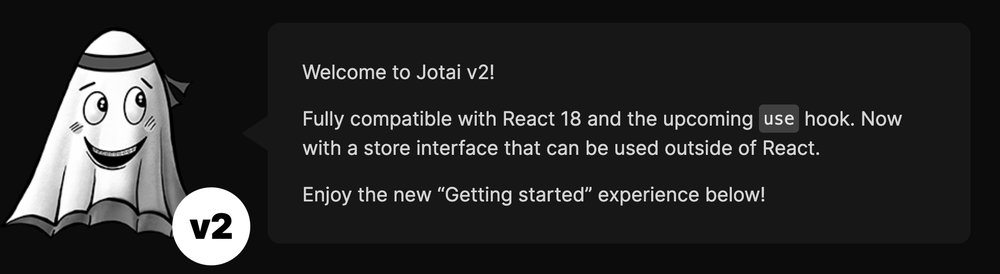
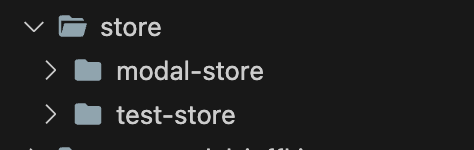
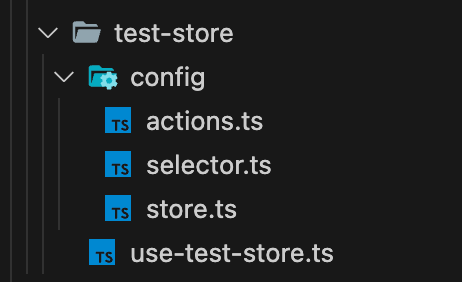

바쁘다 바빠  
오랜만에 글을 쓰는 것 같다. 일도 너무 바쁘고 현생사느라 바빠 글을 남기지 못했지만  
그래도 중간중간 기록이 필요한 것 같아 급하게 글을 적는다.

현재 회사 프로젝트에서는 graphql 을 위해 apollo client 를 사용하기 때문에  
별도의 state management 를 사용하지 않았다.

state 관리가 필요할땐 rxjs 의 subject 를 활용하거나  
react 자체에서 제공하는 useReducer 를 활용해 간단한 reducer 를 만들어 사용했다.

사실 현재 서비스 개발을 시작한지 오래되었고, 다양한 컨벤션이 존재하지만  
state 관리에 대해선..크게 신경쓰지 않았다.

대부분의 데이터는 apollo client 의 cache 로 해결이 되고, 간단한건 위에 적었듯  
rx 또는 reducer 를 활용했다.

하지만..팀원이 늘어나며 각각 자신의 코딩 스타일을 접목하여 state 를 처리하기 시작하니  
이게 서로 알아볼 순 있지만 일관성이 점점 사라지니 피로도가 증가하기 시작했다.

각 팀원에게 자유도를 최대한 주고, 서로 피드백을 주고 받으며 점점 발전시켜가고 싶었지만  
이젠 결정을 해야 할때가 되었다.

다양한 state management 라이브러리가 존재하지만  
일단 자유도가 높고, 쓰기 쉬우며, 작은 라이브러리가 필요했다.

그래서 급하게 zustand, recoil, jotai 등을 살펴보고  
결국 jotai 를 일단 도입하게 되었다.

## Jotai



이글에서 jotai 는 어떤 철학이 있고, 동작원리는 어떻고, 다른 라이브러리와 비교시  
어떤점이 좋다 ~~~ 라는 걸 설명하진 않는다.

검색만 하면 그에 대한글이 아주 많으니 해당 글들을 참조하자.  
이글에서는 나처럼 빠르게 결정하고, 빠르게 컨벤션을 만들기 위한 사람에게 도움이 되길 원하며  
초기 컨벤션의 모습을 적어볼까 한다.

Jotai 는 어떠한 프레임워크에도 종속되지 않고, 자유도가 높기 때문에  
초기 컨벤션을 정하려는 팀 또는 개인은 고민이 조금 될 수 있다.

처음부터 완벽한 컨벤션은 없으니 차차 발전시켜 가면 좋을 것 같다.

## Convention

미리 말하지만 Jotai 를 접한지 얼마 되지 않았기 때문에  
잘못된 점이 있다면 꼭 말해주면 좋겠다.

특정 feature 또는 어떤 부분에 대해 store 를 활용하고자 한다면  
해당 store 의 범위를 제한 할 필요가 있다.

특정 Modal, Component 또는 특정 Container 에게만 적용하고 싶다면  
Jotai 에서 제공해주는 Provider 를 사용하자.

```javascript
import { provider } from "jotai"

export const ProviderJotai = () => {
  return <Provider>{children}</Provider>
}
```

그냥 이렇게 감싸 주면 된다.  
Provider 는 react context 와 같이 Provider 내부의 Atom 은  
해당 부모 Provider 를 경계로 별도의 Atom 으로 작동하게 된다.

이 부분은 곧 변경 할테니 Provider 가 이렇구나만 알면되고  
OK 그럼 Store 의 기본요소들, 즉 Store, Actions, Selector 를 적용해보자.

특정 기능에서 사용 할 Container 주변에 Store 폴더를 하나 만든다.  
해당 Store 폴더 안 개별 store 폴더를 만들고 내부에 Config 폴더를 만든다.

그리고 Config 폴더 안 selector, actions, store 이렇게 3개의 파일을 만든다.  
그리고 Store 폴더에서는 React 에서 사용하기 위한 커스텀훅을 만든다.

대략적인 폴더 구조를 보면



이렇개 사용할 Store 가 구분되고



내부에는 설정과 사용할 react hook 이 존재한다.  
만약 React 가 아닌 다른 다른 프레임워크를 사용한다면  
해당 프레임워크에서 사용할 Store 시작점 함수를 만들어 두자.

> 이렇게 하면 Config 내부는 다른 어떤  
> 프레임워크 에서든 사용가능하다.

여기서 간단한 Store 로 예를 만들면

먼저 Store 파일을 보자.  
(모델의 타입이나 이름은 신경쓰지 말자)

```javascript
// store.ts
import { atom } from "jotai"

export interface TestStoreModel {
  marker?: string;
  sheetShow: boolean;
  region: number;
}

const initialTestStoreProp: TestStoreModel = {
  sheetShow: false,
  region: 0,
  marker: "test",
}

const TestStoreAtom = atom < TestStoreModel > initialTestStoreProp

export const TestStoreInfo = {
  store: TestStoreAtom,
  initialTestStoreProp,
}
```

Store 에서는 해당 Store의 Atom 과 초기 값을 정의해준다.  
다음으로 actions 을 보자.

```javascript
// actions.ts
import { TestStoreInfo } from "./store"
import { atom } from "jotai"

const onChangeRegion = atom(null, (_, set, region: number) => {
  set(TestStoreInfo.store, prev => ({
    ...prev,
    region,
  }))
})

const onChangeMarker = atom(null, (_, set, marker: string) => {
  set(TestStoreInfo.store, prev => ({
    ...prev,
    marker,
  }))
})

const onToggleBottomSheetShow = atom(null, (get, set) => {
  set(TestStoreInfo.store, prev => ({
    ...prev,
    sheetShow: !prev.sheetShow,
  }))
})

export const TestStoreActions = {
  onChangeMarker,
  onToggleBottomSheetShow,
  onChangeRegion,
}
```

해당 Store 에서 사용할 Action 들을 정의해둔다.  
마지막으로 selector 를 보자.

```javascript
import { TestStoreModel } from "./store"

export const MainMapStoreSelector = {
  sheetShow: (store: TestStoreModel) => store.sheetShow,
  region: (store: TestStoreModel) => store.region,
  marker: (store: TestStoreModel) => store.marker,
}
```

store 에서 selector 로 사용할 부분을 정의한다.

jotai 는 자유도가 아주 높기 때문에
actions 나 selecor 모두 다양하게 변형 시킬 수 있다.  
위 예제는 정말정말 간단한 부분만 정의했기 때문에  
사용할때는 각자 필요한 만큼 커스텀 해서 사용하자.

## React 에서 사용할때?

이제 selector, store, actions 를 조합하여 React 에서 사용할 수 있도록  
커스텀 훅을 만들어보자.

```javascript
// use-test-store-hook.ts
import { TestStoreActions } from "./config/actions"
import { TestStoreSelector } from "./config/selector"
import { TestStoreInfo } from "./config/store"

export const useTestStore = () => {
  const { store, initialTestStoreProp } = TestStoreInfo

  return {
    store,
    actions: TestStoreActions,
    selector: TestStoreSelector,
    initialTestStoreProp,
  }
}
```

이제 어떤 컴포넌트 에서도 useTestStore 를 활용하여 TestStore 에 접근이 가능하다.  
만약 여러 Store 를 만들어서 활용하고 싶다면?  
다른 Config 를 하나 더 만들어 해당 Hook 에 포함하면 된다.  
이런식으로

```javascript
export const useTestContainerStore = () => {
  const { store: testStore, initialTestStoreProp } = TestStoreInfo
  const { store: modalStore, initialModalStoreProp } = ModalStoreInfo

  return {
    store: {
      test: testStore,
      modal: modalStore,
    },
    actions: {
      test: TestStoreActions,
      modal: ModalStoreActions,
    },
    selector: {
      test: TestStoreSelector,
      modal: ModalStoreSelector,
    },
    initialTestStoreProp,
    initialModalStoreProp,
  }
}
```

계속 확장이 가능하다.  
실제로 사용할때는 어떤식으로 쓸까

```javascript
export const TestComponent = () => {
  const { store, actions, selector } = useTestStore()

  // Selector 예제
  const marker = useAtomValue(
    selectAtom(store.testStore, selector.testStore.marker)
  )
  const sheetShow = useAtomValue(
    selectAtom(store.modalStore, selector.modalStore.sheetShow)
  )

  // actions 예제
  const onToggleSheetShow = useSetAtom(
    actions.testStore.onToggleBottomSheetShow
  )
  const onChangeMarker = useSetAtom(actions.modalStore.onChangeMarker)

  return (
    <div>
      {marker}
      {sheetShow}

      <ContainedButton
        onClick={() => onChangeMarker("당근")}
        children="Marker Actions"
      />
      <ContainedButton onClick={onToggleSheetShow} children="sheetShow" />
    </div>
  )
}
```

그냥 이렇게 원하는 Store 에서 원하는 selector 와 action 을 가져다  
사용하면 된다.

## Provider 는?

이제 다시 Provider 를 살펴보자.  
어쨌든 Atom 은 React 의 life cycle 외부에 정의해야 하기 때문에  
기본적으로 Global 로 동작하게 된다.

이렇게 되면 프로젝트가 커질수록 추적이 힘들고 공유 컴포넌트나 기능에서  
같은 Store 를 사용하기 힘들다.

이제 Provider 로 경계를 맞춰주면 되긴 하는데, 이왕 감싸는거  
다양한 Store 와 초기 값을 넣어 줄 수 있도록 Util 을 만들어 보자.

```javascript
import { PropsWithChildren, ReactNode } from 'react';
import { Provider, WritableAtom } from 'jotai';
import { useHydrateAtoms } from 'jotai/utils';

type AnyWritableAtom = WritableAtom<unknown, any[], any>;
export type AtomTuple<A = AnyWritableAtom, V = unknown> = readonly [A, V];

interface ProviderByJotaiProps {
  store: AtomTuple[];
}

type HydrateAtomsWithInitial = {
  children: ReactNode;
};

export function ProviderByJotai({ store, children }: PropsWithChildren<ProviderByJotaiProps>) {
  const HydrateAtoms = ({ children }: HydrateAtomsWithInitial) => {
    useHydrateAtoms([...store]);
    return children;
  };

  return (
    <Provider>
      <HydrateAtoms>{children}</HydrateAtoms>
    </Provider>
  );
}

```

이렇게 Provider 를 만들며 사용하고 싶은 Store 를 주입 받는  
Provider Util 을 만들었다.

실제로 사용하려면

```javascript
export const TestComponent = ({ children }: PropsWithChildren<unknown>) => {
  const { store, initialTestStoreProp, initialModalStoreProp } = useTestStore()

  return (
    <ProviderByJotai
      store={[
        [store.testStore, initialTestStoreProp],
        [store.modalStore, initialModalStoreProp],
      ]}
    >
      {children}
    </ProviderByJotai>
  )
}
```

이런식으로 Provider 에 원하는 Store 와 초기 값을 배열로 넣어 줄 수 있다.  
이제 testStore 와 modalStore 는 해당 children 안에서 global 이 아니고
별도로 작동하게 된다.

## Util을 좀 더 만들어보자

여기서 몇가지 Util 을 추가 해보자.  
jotai 의 홈페이지에도 있는 useSelectAtom, useSplitAtom 을 추가하자.

```javascript
// use-select-atom.ts
import { Atom, useAtomValue } from "jotai"
import { selectAtom } from "jotai/utils"

export const useSelectAtom = <T, Slice>(
  anAtom: Atom<T>,
  keyFn: (v: T, prevSlice?: Slice) => Slice
) => {
  return useAtomValue(selectAtom(anAtom, keyFn))
}

/// useAtomValue(selectAtom(store, selector.marker)) 해당 부분을
/// useSelectAtom(store, selector.marker) 이렇게 사용가능하다.
```

SplitAtom 은 배열 내부에 있는 값들을 별도의 Atom 으로 추출하여  
개별적으로 작동하도록 만드는 기능이다.  
배열 내부의 값 하나하나에 별도로 동작하는 렌더링을 주고 싶을때 아주 좋은 기능이다.

```javascript
// use-split-atom.ts
import { PrimitiveAtom, useAtom } from "jotai"
import { splitAtom } from "jotai/utils"

export const useSplitAtom = <Item>(anAtom: PrimitiveAtom<Array<Item>>) => {
  return useAtom(splitAtom(anAtom))
}
```

위 2개의 기능은 어짜피 Jotai 홈페이지에 나와있다.  
가져다 썼을 뿐이고..

실제로 귀찮은 부분은 따로 있었다.  
action 을 사용할때

```javascript
// action 을 사용할때 useSetAtom 으로 감싸야 한다.
const onToggleSheetShow = useSetAtom(actions.testStore.onChangeMarker)
```

action 사용시 useSetAtom 을 적어주기 힘들다. 아니 귀찮다.  
어짜피 hook 으로 사용된다면 actions 에 정의한 함수를 useTestStore 에서  
미리 지정해주면 좋을 것 같다.

그래서 createActions 를 만들었다.🤡

```javascript

// jotai-create-actions
import { ExtractAtomArgs, WritableAtom, useSetAtom } from 'jotai';

type WithInitialValue<Value> = {
  init: Value;
};

type actionsType<T> = {
  [k in keyof T]: WritableAtom<null, ExtractAtomArgs<T>, void> & WithInitialValue<null>;
};

type WrappedActions<T> = {
  [K in keyof T]: ReturnType<typeof useSetAtom<null, ExtractAtomArgs<T[K]>, void>>;
};

export const jotaiCreateActions = <T>(actions: actionsType<T>) => {
  return {
    ...(Object.fromEntries(
      Object.entries(actions).map(([key, action]) => {
        return [
          key,
          useSetAtom(
            action as WritableAtom<null, ExtractAtomArgs<T>, void> & WithInitialValue<null>,
          ),
        ];
      }),
    ) as WrappedActions<T>),
  };
};
```

actions 를 돌면서 자동으로 함수를 useSetAtom 으로 감싸준다.
이제 useTestStore 훅에서 해당 함수를 사용해주자.

```javascript
// ...
return {
  store: {
    test: testStore,
    modal: modalStore,
  },
  actions: {
    test: jotaiCreateActions < typeof TestStoreActions > TestStoreActions,
    modal: jotaiCreateActions < typeof ModalStoreActions > ModalStoreActions,
  },
  selector: {
    test: TestStoreSelector,
    modal: ModalStoreSelector,
  },
  initialTestStoreProp,
  initialModalStoreProp,
}
// ...
```

이렇게 해두면 이제 사용할때 useSetAtom 으로 감쌀 필요가 없다.

```javascript
const { actions } = useTestStore()
// actions 예제
const onToggleSheetShow = actions.testStore.onToggleBottomSheetShow()
const onChangeMarker = actions.modalStore.onChangeMarker()
```

아 귀찮은 부분을 조금씩 지워나가고 있으니 속이 시원하다.  
Jotai 의 장점이다. 자유도가 뛰어나기 때문에 util 이나 custom hook 을  
어떤식으로 만들지는 사용자의 손에 달려있다.

추가로 살펴 볼 유용한 Util 은  
focusAtom 과 atomWithObservable 이다.

그리고 중첩 Provider 사용시 유용한 jotai-molecules.  
모두 설명하기엔 힘드니, 사용법을 보고 꼭 적용시켜보길.

위 컨벤션은 Jotai 를 처음 도입할때 도움이 되길 바라는 초기 컨벤션 이며,  
여기서 util 을 더 추가하고, 불편한 부분은 수정하면서  
 각자의 프로젝트에 맞게 변형해서 더욱 효율적이고 편하게 활용해보면 된다.

글을 짧게 쓰려 했는데 쓰다보니 많아졌다.  
하고 싶은 말이 더 많지만 이것도 줄이고 줄였다.

> 혹시나 잘못된 부분이나 오타가 있다면 알려주면 감사하겠습니다.🥹

그럼 손가락이 아파서 이만.🥹
