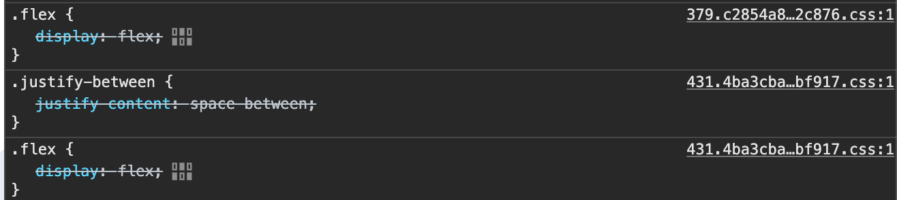

오늘은 MFA(feat.Module Federation)에서  
tailwindcss 를 좀더 자연스럽게 사용하는 팁을 적어본다.

하나의 프로젝트를 여러 모듈로 나뉘어 개발할때 중요한 부분 중 하나는  
각 모듈이 하나의 기능을 가지고 독립적으로 실행 가능하도록 개발하는 것이 좋다.

module federation 역시 양방향으로 사용가능하기 때문에  
remote 로 내보내는 모듈들 역시 host 가 되었든 host 에서 사용하게 되든  
독립적인 실행이 가능해야 한다.

비즈니스 로직이나 상태 관리는 js 로 컨트롤이 가능하기 때문에  
각 모듈별 요구사항을 충족하게 만드는데 어렵지는 않다.

다만 style 은 조금 다르다.

웹을 기준으로 보면 remote 모듈은 결국 하나의 browser 에서 실행되는데  
우리의 browser 에서 style 을 처리할때는  
css 라는 이름처럼 cascading 하게 처리하게 되는데 여기서 같은 Specificity 를  
가지게 되면 나중에 들어오는 style 이 앞의 style 을 덮어 쓰게 된다.

이런 css의 알고리즘은 일반적으로는 문제가 되지 않지만 tailwind 에서는  
약간의 문제가 생긴다.

## Tailwind 의 Specificity

예를 들어

```javascript
function CustomInput(props) {
  const className = `border rounded px-2 py-1 ${props.className || ""}`
  return <input {...props} className={className} />
}

function MyInput(props) {
  return <CustomInput {...props} className="p-3" />
}
```

위 예에서 MyInput 의 classname 은 `border rounded px-2 py-1 p-3` 이 생성된다.  
하지만 `px-2` 와 `py-1` 그리고 `p-3` 은 같은 특이성을 가진다.

그리고 tailwind 에서 classname 을 생성할때 css 의 순서는 아래 순서대로 생성된다.

> className 에 적힌 class 의 순서는 아무의미 없다.

```javascript
.p-3 {
  padding: 0.75rem/* 12px */;
}

.px-2 {
  padding-left: 0.5rem/* 8px */;
  padding-right: 0.5rem/* 8px */;
}

.py-1 {
  padding-top: 0.25rem/* 4px */;
  padding-bottom: 0.25rem/* 4px */;
}
```

결국 `px-2` 와 `py-1` 이 적용되고 `p-3` 은 무시 되는 효과가 나타난다.  
이문제는 MFA 가 아닌 일반적인 프로젝트에서도 볼 수 있는 문제 중 하나이다.  
이 문제를 해결하기 위한 라이브러리가 존재한다.

<a href="https://github.com/dcastil/tailwind-merge" target="_blank">Tailwind-merge</a>
라는 라이브러리를 사용하면 깔끔하게 충돌되는 className 을 제거해주고, 위 문제를 해결할 수 있다.

```javascript
function CustomInput(props) {
  const className = twMerge("border rounded px-2 py-1", props.className)
  return <input {...props} className={className} />
}
// -> className => border rounded p3
```

자세한 사용법은 해당 github 을 참조하자.
그럼 이제 2번째 문제로 가보자.

## Utility className 의 독립성

Tailwind 의 장점 중 하나는 className 에 유틸리티 클래스를 사용하여 style 을  
빠르게 작성하고, 공유할 수 있다는 점이 존재한다.

Tailwind 의 트리쉐이킹인 purge 동작은 해당 모듈에서 사용하지 않는 css 를 제거해주는  
아주 좋은 최적화 기능이다.  
하지만 이 부분이 결국 MFA 를 만들때 걸림돌이 된다.

예를 들어 `Host`, `Module A`, `Module B` 3개의 모듈이 존재한다고 할때,  
우리가 원하는건 각 모듈이 독립적인 style 을 가져가고, 어떤 모듈에서 remote 로 호출되어도  
style 을 유지하기를 바랄 것이다.

만약 remote 에서 tailwind 가 없다면? remote 를 부르는 host 에서 해당 remote 모듈의  
style 을 가지고 있지 않는 한 remote 모듈의 style 을 정상적으로 적용되지 않는다.

예를 들어,

```javascript
// Remote A
const RemoteA = () => {
  ;<div className="grid grid-cols-1">RemoteA</div>
}

// Remote B
const RemoteB = () => {
  ;<div className="grid grid-cols-2">RemoteB</div>
}

// Host
import "./styles.tw.css" // tailwindcss
const HostComponent = () => {
  return (
    <>
      <div className="flex items-center">
        // Remote A 와 Remote B 를 가져온다.
        <RenderRemoteA />
        <RenderRemoteB />
      </div>
    </>
  )
}
```

여기서 `RemoteA` 와 `RemoteB` 는 생성된 css style 없이 Host 로 가게 된다.  
하지만 Host 가 가지고 있는 class 는 tailwind 의 최적화로 인해 `flex items-center`  
두개의 css style 만 가지고 있으므로 remote 들은 style 이 적용되지 않는다.

결국 Remote 들이 각자의 style 을 가지고 있기 위해서는 Host 처럼 각각
`import './styles.tw.css'` 이런식으로 tailwind 를 가지고 있어야 한다.

그럼 문제가 해결되었나? 해결 된듯 해 보이지만 아직도 문제가 존재한다.  
일반적인 classname 은 중복이 되어도 다른 모듈의 css 항목이 가지고 있기 때문에,  
문제가 되지 않지만 `@media` 와 같은 항목을 사용할때는 문제가 생긴다.

```javascript
/* ModuleA CSS */
@media (min-width: 640px) {
  .sm\:hidden {
    display: none;
  }
}
@media (min-width: 768px) {
  .md\:block {
    display: block;
  }
}


/* ModuleB CSS */
@media (min-width: 640px) {
  .sm\:hidden {
    display: none;
  }
}

```

이런식으로 Module A, B 가 각각 `@media` 항목을 사용할때, 둘의 특이성은  
동일하기 때문에 뒤늦게 로드되는 style 이 먼저 로드된 style 을 덮어 버리게 된다.  
위 media 쿼리의 정렬 문제는 `postcss-sort-media-queries` 로 해결할 수는 있다.

그럼 이제 모두 해결된건가? 해치웠나?  
아직 문제가 남아있다.

## Utility className 의 중복

remote 모듈이 몇개 없을때는 문제가 되지 않지만, remote 모듈이 많아지면  
각 remote 모듈마다 동일한 classname 을 가진 stylesheet 가 생성되기 때문에  
같은 classname 의 중복이 무자비하게 생성된다.



이런식으로 쌓이게 된다.

classname 이 계속 쌓이게 되면 이는 결국 성능저하를 가지고 오게 되며  
해당 Element 의 style 을 디버깅 할때 걸림돌이 될 수 있다.

이를 해결하기 위해서 몇가지 방법이 존재한다.

## 해결법

1. 첫번째는 `Tailwind 를 Host 나 Root 에서 한번 포함한다.`

remote 모듈에서 각각 tailwind 를 불러오지 않고, root 에서 한번만 불러오거나,  
해당 remote 를 사용하는 Host 에서만 생성하면 이런 중복을 줄일 수 있을 것이다.

만약 root 에서 한번 불러온다면, 해당 Root 에는 모든 tailwind class 가 포함되어야  
하며, 이는 tailwind 의 최적화 기능을 사용할 수 없기 때문에 좋은 방법이 아니다.

그럼 특정 Host 에서 불러온다면?  
style sheet 는 빌드 타임에 생성된다. 그런데 Host 에서는 자신이 불러오는 Remote 모듈에서  
사용되는 class 를 과연 알수 있을까?

Host 의 tailwind content 설정에 사용하는 Remote 모듈의 path 를 등록한다면  
빌드타임에 알수는 있을 것이다.

하지만 MFA 나 ModuleFederation 에서 remote 모듈은 독립적으로 개발하고 배포된다.  
만약 remote 의 style 이 변경되어 배포 된다면 그 변경사항을 Host 가 알수 있을까?

Host 가 변경사항을 적용하기 위해서는 사용하는 remote 모듈이 변경될때 Host 본인도  
다시 빌드가 되어야 한다.

이는 Host 와 Remote 에 거대한 의존성이 생기게 되고, MFA 와 개발원칙과 어울리지 않는  
방식으로 변하게 된다.  
추가로 해당 의존성은 어떻게 관리할 것인가?  
만약 해당 Host 도 또 다른 Host 에 연결되어 있다면?

2. 두번째는 `twin.macro 와 같은 css-in-Js 를 사용한다.`

css-in-js 는 여기서 좋은 해결법이 될 수 있다.  
런타임에 난독화된 classname 의 style 을 inject 하기때문에  
각 모듈간 classname 의 충돌도 없고  
twin.macro 같은 경우 tailwind 문법을 그대로 사용할 수 있기 때문이다.

하지만 이를 위해선 className 에서 별도의 함수로 매번 감싸줘야 하는 불편함이 있고,  
추가로 css-in-js 의 동작방식으로 인한 추가 런타임 비용이 들어가게 된다.

3. 세번째는 `tailwind 자체적으로 prefix 를 붙여준다.`

Tailwind 에서는 자체적으로 className 의 충돌을 막기 위해 prefix 옵션을 제공한다.

```javascript
module.exports = {
  prefix: "custom1-",
}
```

이렇게 하면 실제로 개발 할때

```javascript
<div className="custom1-grid custom1-grid-cols-1">
  <span>Custom</span>
</div>
```

이런식으로 prefix 를 제공할 수 있고, 생성되는 css 에서도 prefix 가 붙어 나오게 된다.  
추가로 vscode 같은 ide 에서도 자동완성 역시 지원된다.

다만 이 방식의 단점은 가뜩이나 긴 classname 을 더 길게 만들어 DX 가 저하되고,  
classname 을 복사해서 다른 모듈에서 사용하기가 아주 불편해지는 점이 생긴다.

4. 네번째는 `ShaodwDom` 을 사용해 dom 을 캡슐화 시킨다.

ShaodwDom 을 활용해서 해당 모듈을 dom 트리에서 별도로 격리 시켜 버리면, 해당 모듈들은  
같은 className 이라도 독립적인 style 을 활용할 수 있게 된다.

하지만 이는 또다른 문제를 야기한다.  
말 그대로 격리되어 있기 때문에 디자인 시스템과 같은  
공유 컴포넌트를 사용하기 위해서는 해당 remote 모듈에서 공유 컴포넌트의 style 을  
전부 가지고 있어야 한다.  
배보다 배꼽이 커질 수 있는 방법이다.

이 모든 해결법에는 모두 tradeoff 가 존재한다.  
실제로 moduleFederation 에서 알려진 큰 문제점 중 하나이다.

<a href="https://github.com/nrwl/nx/issues/9784#issuecomment-1095128433" target="_blank">Nx Git Issue</a> 해당 링크를 살펴보면 Nx 의 개발자가 이 문제에 대해 설명을 잘 해준다.

## 새로운 해결법

결국 개발 할때는 기존 Tailwind 를 사용하듯이 일반적으로 사용하고,  
빌드 될때는 모든 classname 에 prefix 가 붙어서 빌드 된다면 이문제는 해결된다.

이를 해결하기 위해 몇가지 트릭을 사용했다.  
먼저 postcss 의 `postcss-prefix` plugin 을 사용해 빌드될때 styleSheet 의 모든  
className 에 고유 prefix 를 붙여준다.  
가장 좋은 prefix 는 해당 package 또는 모듈의 이름이다.

prefix 가 붙은 styleSheet 의 style 을 적용하기 위해서는 실제 컴포넌트에서도  
해당 prefix 가 붙은 className 을 써야한다.

예를들어 `custom1-flex custom2-items-center` 이런식으로 써야 하는데  
위에 적었듯이 개발할때는 일반적인 tailwind 를 사용하고  
빌드될때 해당 부분을 변경해줘야 한다.

이를 위해 Webpack 의 `string-replace-loader` 를 사용해서 빌드타임때 dom 의 className에 있는 class 앞에 모두 prefix 를 붙여줄 것 이다.

예를들면 이런식이다.

```javascript
const twClassnameTransForm = prefix => {
  return {
    test: /\.tsx$/,
    loader: "string-replace-loader",
    options: {
      search: /className=['"]([^'"]*)['"]/g,
      replace(_, p1) {
        const classNames = p1.trim().split(" ")
        const prefixedClassNames = classNames.map(className => {
          if (className.startsWith(prefix)) {
            return className
          } else {
            return `${prefix}-${className}`
          }
        })
        return `className="${prefixedClassNames.join(" ")}"`
      },
    },
  }
}
```

해당 loader 를 사용하면 실제로 작성한 tailwind className 앞에 내가 원하는 prefix 가  
모두 붙어서 빌드 된다.

```javascript
<div className="grid grid-cols-1">
  <span>Custom</span>
</div>

// 빌드 후

<div className="custom1-grid custom1-grid-cols-1">
  <span>Custom</span>
</div>
```

이런식으로 추가된다.  
이제 각 모듈간 독립적으로 className 을 가지게 되며, 개발 할때는 일반적인  
tailwind 의 사용을 활용할 수 있게 된다.

## TwMerge 를 포함한다면?

위 방법은 단순히 className 을 string 으로만 적었을때 적용할 수 있다.  
하지만 TwMerge 나 props 로 className 을 받아서 적용할때는 어떻게 해야 할까?

```javascript
<div className={twMerge("grid grid-cols-1", props)}>
  <span>Custom</span>
</div>

// 또는

<div className={`grid grid-cols-1 ${props}`}>
  <span>Custom</span>
</div>
```

`string-replace-loader` 는 단순하게 string 찾아서 변경시켜 주기 때문에
이런식의 className 은 변환 시킬 수 없다.

이를 해결하기 위해서는 별도의 Util 이 필요하다.  
먼저 TwMerge 에서 옵션으로 prefix 설정을 추가하고 별도의 함수로 추출해야 한다.

```javascript
const extendsTwMergeConfig = ... // twMerge theme 관련 custom 설정

const twMerge = (prefix: string) => {
  return isDev
    ? extendTailwindMerge(extendsTwMergeConfig)
    : extendTailwindMerge({
        ...extendsTwMergeConfig,
        prefix: `${prefix}-`,
      });
};

export const twCombine = twMerge(packageName);

```

이런식으로 twMerge 를 개발환경일때는 prefix 를 붙이지 않고 빌드 환경일때만 prefix 가 적용 되도록
하여 `twCombine` 이라는 함수를 유틸로 노출한다.

그리고 이 역시 `string-replace-loader` 를 사용해서 변경해주는 loader 가 필요하다.

```javascript
// transform util
const twMergeClassNameAddPrefix = (classNames, prefix) => {
  const transCls = classNames.map(className => {
    const pattern = /[\'\"]+/g
    if (!pattern.test(className)) {
      return className
    }

    const trimClassName = className.replace(pattern, "")
    if (trimClassName.startsWith(prefix)) {
      return trimClassName
    } else {
      return `"${prefix}-${trimClassName}"`
    }
  })
  return transCls
}

// 실제 Loader
const twMergeClassnameTransForm = prefix => {
  return {
    test: /\.tsx$/,
    loader: "string-replace-loader",
    options: {
      search: /className={twCombine\((.*?)\)}/g,
      replace(_, p1) {
        const classNames = p1.trim().split(",")
        const prefixedClassNames = classNames.map(className => {
          const trimed = className.trim()
          const splitClass = trimed.split(/\s+/)

          if (splitClass.length > 1) {
            return twMergeClassNameAddPrefix(splitClass, prefix)
          }

          const pattern = /[\'\"]+/g
          if (!pattern.test(trimed)) {
            return trimed
          }

          const trimClassName = trimed.replace(pattern, "")
          if (trimClassName.startsWith(prefix)) {
            return trimClassName
          } else {
            return `"${prefix}-${trimClassName}"`
          }
        })
        return `className={twCombine(${prefixedClassNames.join(", ")})}`
      },
    },
  }
}
```

twCombine 의 변형은 조금 더 복잡하다.  
중첩되는 className 과 ',' 로 구분되는 className 으로 인해 로직이 더 생겼다.

추가로 props 로 받는 className 에 대해서도 별도의 util 을 만들어서 자동으로 prefix 가  
들어가도록 수정한다.

```javascript
const cxSet = (prefix: string) => {
  return function (cls: string) {
    const result: string[] = []
    const clsDest = cls.split(" ")

    clsDest.forEach((maybeClass: string) => {
      if (maybeClass) {
        result.push(`${prefix}-${maybeClass}`)
      }
    })

    return result.join(" ")
  }
}

const twProps = (pkgname: string) => {
  const cx = cxSet(pkgname)
  return (className: string) => (isDev ? className : cx(className))
}
```

`twProps` 같은 경우 `twCombine` 과 마찬가지로 개발환경에서는 일반 className 을  
return 하고 빌드타임때는 prefix 를 붙이도록 되어있다.  
실제로 사용할때는 이런식으로 사용이 가능하다.

```javascript
const className = "flex"
const App = () => {
  const ref = false
  return (
    <div
      className={twCombine(
        "grid grid-cols-1",
        twProps(ref ? " px-0" : "py-2"),
        twProps("p-3")
      )}
    >
      Template
    </div>
  )
}

// 또는 TwProps With Combine
<div
  className={twCombine(
    twProps("grid grid-cols-1"),
    twProps(ref ? " px-0" : "py-2"),
    twProps("p-3")
  )}
>
  twProps
</div>

// 단순히 props 로 className 을 받았을때
<span className={twProps(`grid grid-cols-[1fr_1fr] ${className}`)}>
  Span
</span>

// 일반적인 사용
<span className="grid grid-cols-[1fr_1fr]">Center</span>
```

이제 위 모든 className 이 build 할때 지정한 prefix 가 들어가게 된다.

> 주의할 점은 `twCombine` 사용시 아래처럼 `string className` 이 twProps  
> 사이에 있으면 안된다.  
> `string className`은 처음 시작되거나, 그게 아니면 twProps 로만  
> 사용되어야 한다.

```javascript

// OK
<div
  className={twCombine(
    twProps("grid grid-cols-1"),
    twProps(ref ? " px-0" : "py-2"),
    twProps("p-3")
  )}
>
  twProps
</div>


// OK
<div
  className={twCombine(
    "grid grid-cols-1",
    twProps(ref ? " px-0" : "py-2"),
    twProps("p-3")
  )}
>
  twProps
</div>


// FAIL!!
<div
  className={twCombine(
    twProps("grid grid-cols-1"),
    "flex",
    twProps("p-3")
  )}
>
  twProps
</div>

```

## 마무리

webpack 의 loader 와 별도의 util 함수를 활용해 DX 저하는 없애고,  
실제로 빌드된 모듈에서는 독립적인 className 을 갖도록 하여 className 의 중복과  
충돌을 없어지도록 만들었다.

물론 여기서도 tradeoff 가 존재한다.

twProps 라는 함수로 감싸야 하는 점과 별도의 공통 util 함수를 추출해야 하는점,  
webpack 을 사용해야 한다는점, 그리고 React 기준이라는 부분.  
twCombine 사용시 주의해야 할 부분 등.

위 방법도 어디서 언제 문제가 생길지 모르고, 그냥 tailwind 를 moduleFederation 에  
적용하기 위한 또 하나의 방법이라고 봤으면 좋겠다.  
다행히 아직까지는 문제가 없다.

다른 번들러에서도 `string-replace-lorder` 와 같은 플러그인이 있어서  
방법만 안다면 충분히 활용해볼만 하다.

해당 방법을 사용하기 위한 함수와 설명은 충분히 한 것 같아, 별도의 디테일한 설정은  
따로 기술하지 않겠다.

그리고 혹시 tailwind 를 module federation 에서 사용하고 있고,  
위와 같은 문제를 겪은 뒤 해결한 경험이 있다면 연락해줬으면 한다. 🥹

다음 글은 아마 `Signal` 에 대한 글로.
