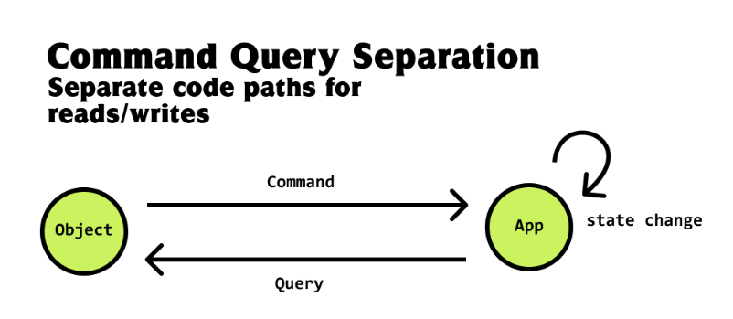

앱을 개발하며 컴포넌트를 만들고 구조를 설계할때 어떤식으로 하면 좋을까  
인터넷이나 책에 다양한 방식의 설계 방법이 존재하고 있지만 공통적으로 말하고 있는 부분은  
비즈니스 로직을 어디다 둘 것인가, 상태관리를 어떤식으로 할 것 인가에 따라  
서비스 설계의 많은 부분이 변경된다.

물론 리팩토링은 꾸준히 하겠지만 처음 만들때 제대로 정해두지 않으면 팀이 커질수록  
서비스 유지보수에 많은 어려움이 생기고 DX에 악영향을 끼칠수 있다.

시중에 나와있는 다양한 패턴을 다 설명하는 것 보다 기본적으로 컴포넌트를 만들때  
요정도의 지식을 알고 있다면 추후 서비스를 개발할때 처음부터 헤메는 일은 없을 것 이라 본다.

> 모든 코드는 React 기준으로 작성되어있다.  
> 다만 단순히 컴포넌트의 구축 방향을 보기 때문에  
> 타 UI 프레임워크 에서도 응용할 수 있다.

가장 기본적이고 먼저 볼 부분은 `Statless` 컴포넌트 다.  
말 그대로 이 컴포넌트는 상태를 가지고 있지 않고 오로지 UI 에 집중되어 있다.

예를 보자.

```javascript

interface CountControlProps {
  control: {
    increment: () => void;
    decrement: () => void;
    reset: () => void;
  }
  count: number
}

export function CountControl({ control, count = 0 }: CountControlProps) {
  const { increment, decrement, reset } = control;

  return (
    <div>
      <button onClick={increment} type="button">
        Increment
      </button>
      <button onClick={decrement} type="button">
        Decrement
      </button>
      <button onClick={reset} type="button">
        Reset
      </button>
      <p>count: {count}</p>
    </div>
  )
}
```

내부에서는 별도의 상태를 가지지 않고 외부에서 모든 `state` 와 `control` 을 주입받는다.

`Statless` 장점은 일단 의존하는 부분이 없기 때문에 `재사용성이 매우 높고`  
모든 것이 외부 입력에 의해 컨트롤 되므로 `테스트 하기가 쉽다`.  
아마 디자인 시스템의 대부분 UI 컴포넌트에서 사용될 것이다.

다음으로 볼 컴포넌트는 `Stateful` 컴포넌트다.  
`Statless` 와 다르게 `Stateful` 은 컴포넌트가 로컬 State 와 로직을 가지고 있다.  
위 CountControl 컴포넌트를 `Stateful` 로 변경하면 아래와 같다.

```javascript
export function CountControl() {
  const [conut, setCount] = useState<number>(0);
  const control = {
    increment: () => setCount(count + 1),
    decrement: () => setCount(count - 1),
    reset: () => setCount(0),
  }

  const { increment, decrement, reset } = control

  return (
    <div>
      <button onClick={increment} type="button">
        Increment
      </button>
      <button onClick={decrement} type="button">
        Decrement
      </button>
      <button onClick={reset} type="button">
        Reset
      </button>
      <p>count: {count}</p>
    </div>
  )
}
```

`Stateful` 은 로컬 State 를 가지며, 자체적으로 State 를 컨트롤한다.  
당연히 외부 주입도 없고, 의존성도 없으며 local state 로 작동하기 때문에  
`Stateless` 와 같이 `재사용성이 매우 높으며`, `테스트 하기 쉽다.`

`Stateful` 은 주로 디자인 컴포넌트에서 상태가 필요한 컴포넌트들  
토글바나 다이얼로그, 메뉴 등에 사용된다.

## Domain 과 합체

`Presentatin` 과 `Domain` 을 분리하여 만드는 패턴이다.  
아마 `Container` 라고 불리는 컴포넌트 들이 여기 해당된다.

이때부터는 컴포넌트가 외부 상태와 느슨한 결합이 생기며, 의존성을 가지게 된다.  
예를 들어 서버에서 현재 사용자들을 불러온다고 해보자.

```javascript
// UserListControl

export const useUserListControl = () => {
  const getUsers: Promise<UserModel[]> = async () => {
    const res = await fetch("https://jsonplaceholder.typicode.com/comments").then((res) => res.json);
    return res;
  }

  return {
    getUsers
  }
}

// Container
export function UserListContainer() {
  const [users, setUsers] = useState<UserModel[]>();
  const [isLoading, setLoading] = useState<boolean>(true);

  const { getUsers } = useUserListControl();

  const getUserList = async () => {
    const userList = await getUsers();
    setUsers(userList);
    setLoading(false);
  }

  useEffect(() => {
    getUserList();
  }, []);

  if (isLoading) {
    return <div>Loading</div>;
  }

  if (!users) {
    return <div>No data</div>;
  }

  return (
    <div>
      {users.map((user) => (
        // User 는 Statelss Component 라고 생각하자
        <User user={user} key={user.id}>
      ))}
    </div>
  )
}
```

> 정의된 fetch 는 크게 신경쓰지 말자. 임의로 만든것들이다.

아주 간단한 예제이지만 여기서 `useUserListControl` 은 도메인 로직이며,  
`UserListContainer` 는 `Stateful` 컴포넌트 이면서 내부에서 도메인로직을  
부르기 때문에 도메인 로직과 의존성이 생겼다.

`UserListContainer` 는 `UI 로직에 대한 책임`을 가지고, 도메인과 관련된  
비즈니스 로직에 대한 책임은 `useUserListControl` 훅(또는 서비스)으로 위임했다.

이런식으로 `DomainSide <-> PresentationSide` 로 확실히 분리시켜 두면  
코드를 이해하기 더 쉬울뿐만 아니라 UI 테스트와 비즈니스 로직의 테스트를 용이하게  
만들어준다.

하지만 우리가 아는 실제 서비스들은 훨씬 복잡하겠지?

실제로 위 방식은 비교적 간단한 Container 에서 사용하게 되고  
Depth가 깊어짐에 따라 더욱더 많은 상태를 조작하거나 추가 메소드가 필요해진다.

여기서 CQS 를 결합할 수 있다.  
CQS 는 `Command Query Separation` 즉 읽기와 쓰기를 명확히 분리하는 것이다.



해당 패턴을 적용할때 주의할 점은 실제로 State 가 변경될때 자동으로 전파가 되어야 하며,  
해당 State 를 사용하는 `Usecase` 한테는 동일하게 공유되어야 한다는 것이다.

일반적으로 `ObservableState` 를 만들어야 하는데, 적용 가능한 방법은  
`Signal`, `rxjs` 또는 `Relay` 나 `Apollo client` 로 graphql 을 활용하는 방법 등이  
있겠다.  
아니면 상태관리 패키지를 사용해도 되고.

> gql 을 사용하면 이런 패턴의 상당 부분을 압축 할 수 있다.

일단 여기서는 대중적인? `Rxjs` 로 작성을 해보겠다.  
간단한 TODO List 를 만든다고 생각해보자.

```javascript
import type { Observable } from 'rxjs';
import { BehaviorSubject, map } from 'rxjs';

type Todo = {
  id: number;
  title: string;
  completed: boolean;
};

export const TodoListStateService = () => {
  const todos$ = new BehaviorSubject<Todo[]>([
    {
      id: 1,
      title: 'first todo',
      completed: false,
    },
  ]);

  const addTodo = (title: string) => todos$.next([...todos$.value, {
    id: todos$.value + 1,
    title,
    completed: false,
  }]);

  const toggleCompleted = (id: Todo['id'], completed: boolean) => {
    todos$.next(todos$.value.map((todo) => (todo.id === id ? { ...todo, completed } : todo)));
  };

  return {
    todos$: todos$.asObservable(),
    toggleCompleted,
    addTodo,
  } as const;
};


```

간단하게 만든 TodoState 다.

해당 서비스는 Todo 라는 State 의 상태를 관리하고  
업데이트 한다. 사실 react 와 조금 어울리지 않지만 일단 특정 State 의 상태를 책임지는  
서비스를 만들었다고 생각하자.

그리고 해당 서비스를 이용한 Usecases 를 만들어보자.

```javascript
 export const TodoListUsecase {
   const { todos$, toggleCompleted, addTodo } = TodoListStateService();


    // useObservableState 는 실제로 Observalbe 을 구독해
    // useState 에 저장하는 유틸함수라고 생각하자.

   const todoList = useObservableState({
     obs: todos$
   });

   const inCompletedTodoList = useMemo(() => {
    return todoList.filter((todo) => !todo.completed)
   }, [todoList]);

   const CompletedTodoList = useMemo(() => {
    return todoList.filter((todo) => todo.completed)
   }, [todoList]);

   const addTodoItem = (title: string) => {
     addTodo(title);
   }

   const addTodoIfNotExist = (title: string) => {
     const alreadyExists = todos.find((todo) => todo.title === title);
     if (alreadyExists) {
        return;
     }
     addTodoItem(title);
   }

   const toggleTodoCompleted = (id: Todo['id'], completed: boolean) => {
     toggleCompleted(id, completed);
   }

   // 임의로 query 와 command 를 나눴다.
   return {
      query: {
        todoList,
        inCompletedTodoList,
        CompletedTodoList,
      },
      command: {
        addTodoItem,
        addTodoIfNotExist,
        toggleTodoCompleted
      }
   }
 }
```

이제 컴포넌트는 `Usecase` 에 의존하게 되며 TodoList 의 State 를 읽어오는 것과  
변경하는 명령어 역시 전부 `Usecase` 를 통해 이루어진다.

`Usecase` 는 `StateService` 에 의존해 실제 state 를 변경하기전 추가적인 메소드와  
state 를 제공하며 `Usecase` 레이어의 주요목적은 `StateService`를 은폐하기 위함이다.

도메인과 직접 연결되는 부분에 복잡한 로직과 메소드가 계속 추가 된다면 이해하기도 힘들어지고  
특정 메소드의 테스트에도 많은 부하가 생길 수 있다.  
알수없는 사이드 이펙트는 덤.

추가로 `확장성`과 `재사용성` 그리고 `테스트 용이성`을 위해 관심사를 확실히 분리한 것이다.  
해당 장점들은 왜 장점이 되는지 잘 생각해보자.

이렇게 하면 도메인 테스트와 도메인 데이터를 이용한 조회,변경 테스트를 하기가 용이하다.

추가로 `CQS` 원칙을 사용해 `read` 와 `write` 를 명확하게 분리하여 `query/command`를  
구분하기 쉽고 `Query`는 오로지 read 만 담당하기 때문에 혹시 모를 사이드 이펙트가  
생기지 않는다.

그리고 문제가 생겼을 경우 `Query` 인지 `Command` 인지 디버깅 하기가 쉬워진다.

```javascript
  export function UserListContainer() {
    const { query } = TodoListUsecase();

    return (
      <div>
        {query.todoList.map((todo) => <TodoItem key={todo.id} todo={todo}>)}
        <p>{query.inCompletedTodoList.length}</p>
      </div>
    )
  }
```

```javascript
export function TodoInput() {
  const { command } = TodoListUsecase()
  const [title, setTitle] = useState<string>("");

  return (
    <div>
      <input value={title} onChange={e => setTitle(e.target.value)} />
      <button type="button" onClick={() => command.addTodoItem(title)}>
        Add
      </button>
    </div>
  )
}
```

사용한다면 대충 이런식으로 사용하지 않을까?

> 대략적으로 막 적은 코드라 오타나 type 오류가 있을 수 있다.  
> 그냥 흐름만 보자.

위 코드들은 정말 기본적으로 막 사용한 것들이고 추가로 유명한 상태관리 패키지나  
다른 방식으로 충분히 더 훌륭하게 발전 시킬수 있을 것이다.

위에 적기도 했지만 graphql 을 사용하고 있다면 위 패턴을  
더욱 짧고 쉽게 압축해서 사용할 수 있다.

워낙 요즘 패키지들이 이런 부분을 잘 지원해줘서 개념만 잘 익히고, 실제로 본인이 적용해보며  
이것저것 고쳐 보는게 좋을 것이다.

> 참고한 사이트들

[CommandQuerySeparation](https://martinfowler.com/bliki/CommandQuerySeparation.html)  
[PresentationDomainSeparation](https://martinfowler.com/bliki/PresentationDomainSeparation.html)  
[ApolloClient&client-side-architecture-basics](https://www.apollographql.com/blog/client-side-architecture-basics)

들어가서 한번씩 읽어보면 좋은 글들이다.  
시간이 된다면 꼭 읽어보자.
