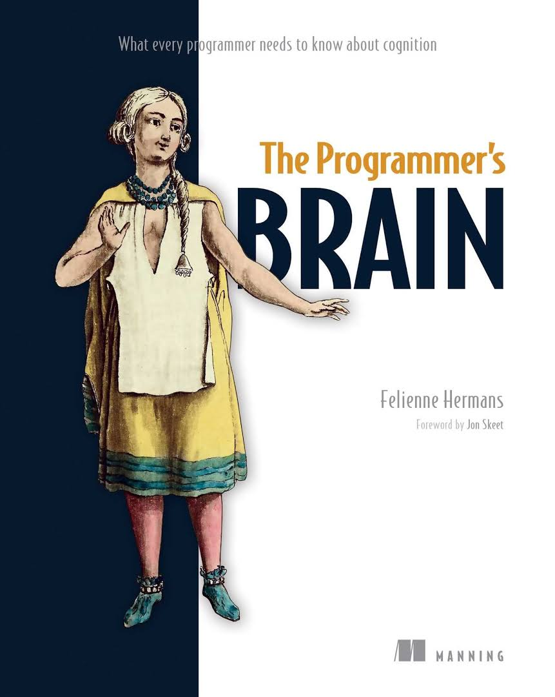

이번엔 최근에 읽은 책의 후기를 적어보려 한다.  
책은  `The Progeammer's Brain` 이다.  



이 책은 인지과학 측면에서 프로그래머가 코드를 보거나 작성할때  
어떻게 생각하는지, 어떤 흐름으로 이어지는지에 대한 설명과  
효율적으로 코드를 작성하고 생각하는 방법에 대해 설명해주고 있다.    

너무 과학적인 용어나 설명만 많아서 읽기 어려운 책은 아니고  
적절한 코드와 해당 사항에 대한 실험 결과, 예제들을 많이 수록하고 있어  
편하게 읽을 수 있었다.  

책의 내용을 간단하게 소개하면 실제로 프로그래머가 생소한 코드를 봤을때  
왜 혼란이 일어나는지, 그리고 어떤 종류의 혼란이 일어나는지에 대해 설명이 되어있다.  

어찌보면 코드 뿐만 아니라 다양한 환경에서도 똑같이 느낄수 있기도 하겠다. 

이책에서는 크게 3가지의 이유로 혼란이 일어난다고 되어있는데  
이는 `지식의 부족`, `정보의 부족`, `처리능력의 부족` 이다.  

`지식의 부족` 은 말그대로 해당 코드에 대한 지식, 즉 내가 모르는 언어라서  
해당 언어의 함수나 기능 자체를 모르는 경우이다.  

`정보의 부족` 은 해당 코드를 읽을 순 있지만 어떤 기능을 하는지 알수가 없을 때다.  
javascript 나 Java 등 우리가 익히 알고 있는 코드를 볼때 만약  

```javascript
  function BinaryCalculator(n: number) {
    return parseInt(n).toString(2);
  }
```

만약 이런식의 코드가 있다면 우리는 코드를 읽을 순 있지만 저 `parseInt` 가  
어떤 기능을 하는지, `toString` 이 어떤 기능인지 알수 없다.  
이것이 정보의 부족이다.  

`처리능력의 부족` 은 코드 자체를 천천히 읽으면 이해할 수는 있으나, 머릿속에서  
모든 정보를 처리 할 수 없는 경우이다.  
이럴땐 변수에 들어가는 값을 따로 메모하거나, 그림으로 적어두기도 한다.  

```javascript
 function whoami(n1) {
    if (n1 === 0) return "0";
    let n2 = "";
    while (n1 > 0) {
        n2 = (n1 % 2) + n2;
        n1 = Math.floor(n1 / 2);
    }
    return n2;
}
```

위 함수를 볼때 코드를 하나씩 읽어가면 어떤 기능인지 알 수 있지만, 처음볼때  
이해하기 어렵고 혼란 스러울수 있다.  
에제를 위해 변수명과 함수명은 일부러 막 적었다.  

위 3가지 부족현상을 인지과학 적으로 말하면
`지식의 부족` 은 `LTM` 의 문제로 이어지고  
`정보의 부족` 은 `STM` 의 문제, `처리능력의 부족` 은 `작업기억 공간의` 문제 가 된다.  

>`LTM`은 `Long-term Memory`, `STM` 은 `Short-term Memory` 이다.  

여기서 `작업기업 공간` 은 `STM` 과 `LTM` 에서 가져온 지식과 정보를 기반으로  
해당 코드를 이해하려 할때 머릿속에서 일어나는 복잡한 작업 과정이라고 볼 수 있다.  

이 3가지 인지과정은 서로 상호작용하며 머릿속에서 작업이 이루어 지는데  
먼저 `STM` 에서 정보를 가져오고, `LTM` 에서는 지식을 가져온다.  

예를 들어 위 BinaryCalculator 함수를 예를 들면  
n 이 정수형이라는 정보는 `STM` 에 저장되고, 동시에 `정수` 라는 개념의 정보는  
`LTM` 에서 가져오게 된다.  

그리고 이를 기반으로 머릿속에서 코드가 어떤 기능을 하는지 파악하는 일은  
`작업기능 공간`에서 이루어진다.  

>이걸 보면서 `LTM` 은 하드드라이브, `STM` 은 메모리,  
>`작업기억 공간`은 CPU 와 비슷하다고  
>느낀 사람도 있을 것이다. 어찌보면 비슷해 보이긴 한다.  

인간의 `STM` 은 한계가 있다고 되어있다.  
책에서는 어느정도의 한계가 있는지 그리고 각 사람, 분야마다 `STM`의 효율이 차이가 나는  
이유가 무엇인지 알기위한 실험 결과가 많이 있다.  

우리가 코드에서 많이 봐온 `청크(Chunk)`라는 개념도 나오며, 이를 활용하는  
`청킹` 작업에 대해서도 나온다.

>`청킹`은 기억의 조각들을 각각의 그룹으로 묶은 `청크` 상태로 만들어 기억하는 것을  
> 말한다.  

보다보면 왜 디자인 패턴이 나오고 발전했으며, 왜 중요한지에 대해 알 수 있다.  
그리고 숙련자와 초보자가 코드를 이해하고 읽을때 어떤 부분때문에 차이가 나는지  
상세히 알수있다.  

위 3가지 개념 `LTM`,`STM`,`작업기업공간` 을 가지고  
뇌에서 어떤 작업을 하고 있는지, 그리고 코드를 효율적으로 작성하고  
이해하기 쉽게 적는 방법에 대해 쭉 나와있다.  

특히 뒷부분에서는 팀에서의 효율적인 협업 작업과 신규 팀원이 합류했을때  
빠르게 회사 코드에 적응시킬수 있는 훈련법도 소개하고 있어 도움이 많이 되었다.  

적은 예제들은 책의 극초반부에 나오는 내용으로 이외에도 많은 유익한 내용이 있으니  
시간이 된다면 한번 읽어 보길 추천하는 책이다.  


