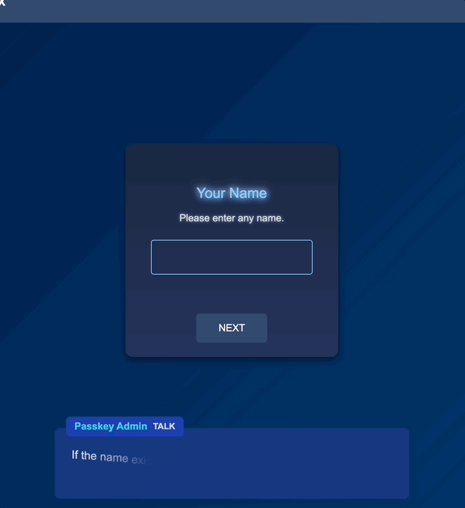
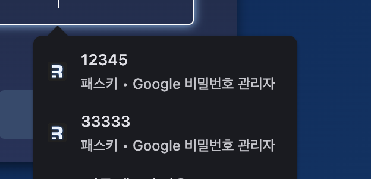
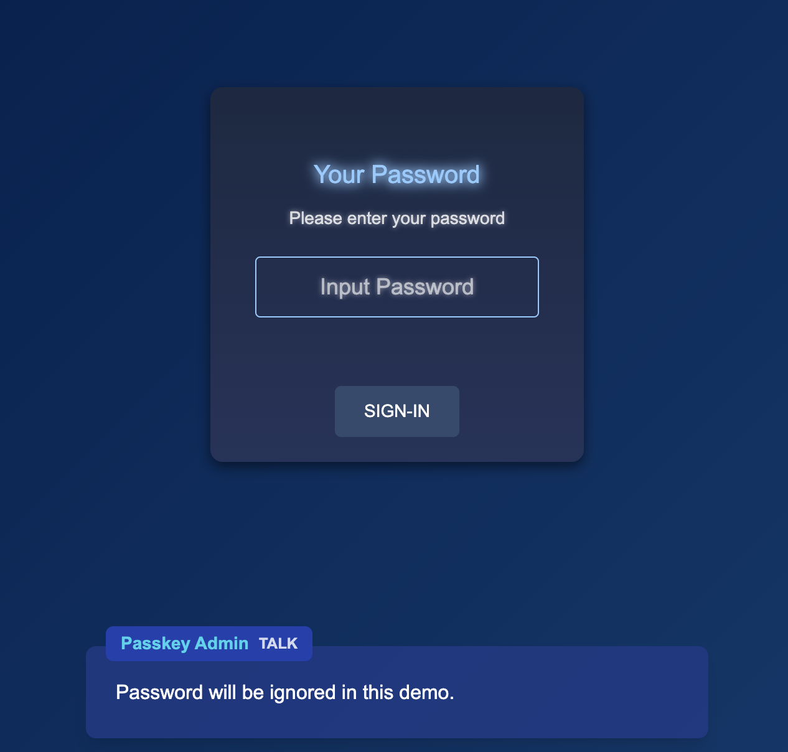
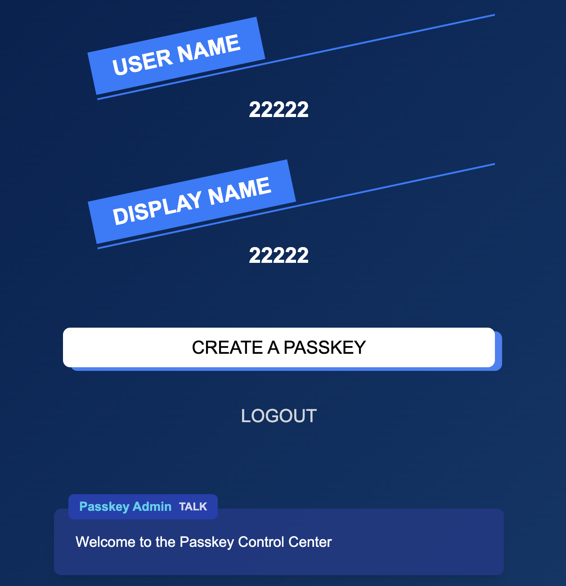
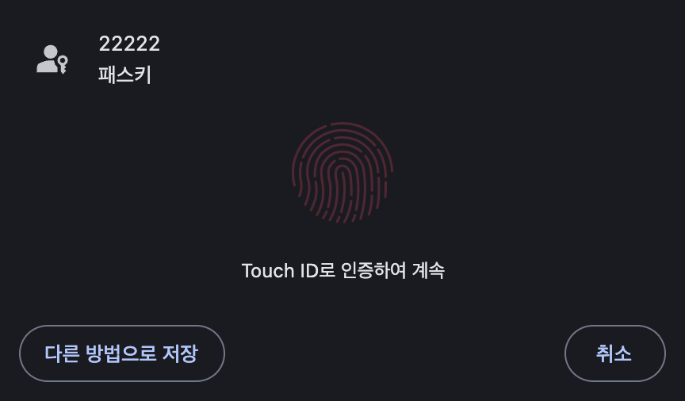
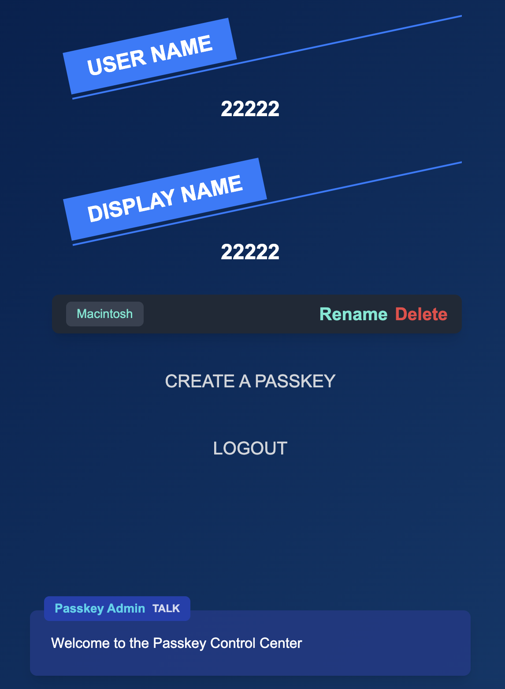
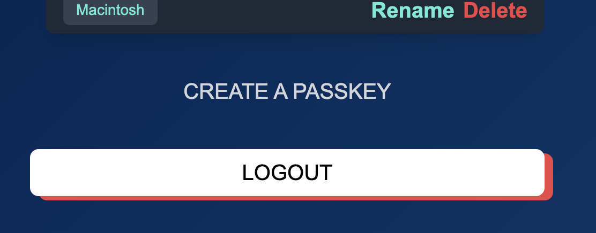
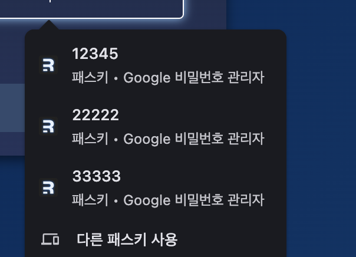

대부분의 사이트가 ID, PW 를 입력하고 들어가게 되는데, 주기적으로 비밀번호를 변경하도록  
권장 또는 강제적으로 사용자에게 요구하고 있다.

이때 비밀번호를 변경할때 대부분의 사람들은 이전 비밀번호와 완전히 다른 비밀번호를 입력하기  
보다 대부분 이전 비밀번호에서 1~2개의 숫자 또는 영문을 변경해서 변경하게 된다.  
아마 다들 본인만의 비밀번호를 하나씩 간직하고 있으리라.

이 패스워드 방식의 문제점은 예전부터 지적되었지만 하나의 비밀번호가 노출된다면  
내가 사용하는 모든 사이트가 다 털릴 위험이 존재한다.

이걸 보완해서 이제는 2차 인증을 하기도 하는데 Authenticator 앱을 활용해 2FA 를  
활성하거나, 해당 서비스 전용앱으로 이를 수행하기도 한다,

또는 구글의 패스워드 관리자는 그냥봐도 외우기 힘든 난해한 비밀번호를 자동으로 추천해주고  
저장해주기도 한다.

이 시점에서 예전에 어떤 사이트 인지 기억 나진 않지만 패스키를 생성해서 로그인 했던  
기억이 있다.

그때 맥북에 있는 지문으로 패스키를 만들고 특정 사이트에 등록해두면 해당 서비스에 접근할때  
간편하게 지문으로 로그인해서 편리했던 기억이 있다.  
추가로 맥북이 없을때는 모바일의 생체인증을 이용해서 로그인 할 수 있었다.

그래서 이 기회에 패스키를 알아보고 예제를 만들어 보았다.

## FIDO

일단 패스키를 만든 집단(?)을 알아보려면 `FIDO(Fast IDentity Online) Alliance` 를  
알아야 한다.

FIDO 연합은 온라인 인증을 간소화하고 보안을 강화하기 위헤 2012년에 설립된  
비영리 단체이다.

이들은 인증을 위한 `UAF`, `U2F`, `FIDO2` 표준을 만들었는데 현재 많은 곳에서 이 표준을 이용하여  
서비스 되고 있다.

간단히 `UAF (Universal Authentication Framework)` 는 비밀번호가 없는 인증을  
목표로 만들어진 표준이며 현재 우리가 많이 사용하고 있는 생체인식 또는 PIN 번호를 사용해  
인증을 수행하게 된다.

`U2F (Universal 2nd Factor)` 는 기존 비밀번호 인증에 2단계 인증을 추가하기  
위해 설계된 표준으로 주로 물리 보안키를 사용하는 인증에 사용된다.

마지막으로 `FIDO2` 가 지금 설명하려는 패스키가 따르는 표준이며, 비밀번호 없이 인증을 가능케  
하는 표준이다.

현재 FIDO 연합에는 Apple, MS, Google, 샘숭 등 많은 글로벅 빅테크 기업이 참가해  
안전하고 편리하며, 크로스 인증이 가능하도록 노력 중이다.  
우리는 그걸 일단 쓰면 된다.

## 패스키?

생체인증만큼 안전한 인증이 있을까?  
패스키에서는 우리가 주위에서 많이 접하는 Touch ID, Face ID, Windows Hello 등  
생체인식을 활용해 패스워드 없는 안전한 인증을 보장한다.

생체인식의 장점은 말안해도 다들 알고 있을거고, 패스키를 사용하게 되면 패스워드의 도난 또는  
비밀번호를 주기적으로 바꾸면서 잊어버리는 불상사를 방지 할수 있다.

위 FIDO 연합에 속한 기업들을 봐도 알겠지만 패스키는 특정 OS, 기기에 속하지 않고  
서로 크로스 인증이 가능하기 때문에 windows 로 등록한 패스키를 맥os 나 모바일에서  
같이 사용할 수 있다.

뭐 그렇다고 장점만 존재하는 건 아니다.  
일단 어쨌든 생체 인식이 가능한 기기가 있어야 하고, 패스워드를 도난,분실의 위험은 없지만  
만약 등록한 모든 디바이스를 잃어버린다면 계정 복구가 조금 복잡해 질 수 있다.  
이 부분은 백업 인증을 추가 함으로써 충분히 해결 될 듯 하다.

가장 큰 문제는 다른 기술들도 그렇지만 초기 단계라 이를 지원하는 서비스가 많이 없는게  
단점일수도? 그 말은 그동안 패스워드만 사용하던 사용자들이 혼란을 겪을 수 있다.

빅테크 기업들은 이미 도입하고 권장을 하고 있긴한데..  
어쨌든 백업을 위해서도 마음 속 패스워드 하나는 다들 가지고 있어야 한다.

## 패스키 생성

`WebAuthn` 이라는 공개키 기반 인증으로 이를 수행하게 된다.  
간단하게 설명하면 User, Client, Server 의 관점으로 보자.

| 기준   | 행동                                                                       | 수신자 |
| ------ | -------------------------------------------------------------------------- | ------ |
| User   | 패스키 생성 요청                                                           | Client |
| Client | 해당 서비스의 도메인, 고유 계정정보 (이메일, 사용자 ID) 전달               | Server |
| Server | 수신 정보로 Challenge, RPID, 공개키 옵션 생성 하여 전달                    | Client |
| Client | Authenticator 에게 수신받은 정보를 전달                                    | User   |
| User   | 생체인식 으로 사용자 본인 인증                                             | Client |
| Client | 공개키,개인키 쌍 생성. 개인키 기기저장 Challenge 개인키로 서명             | Client |
| Client | 공개키, 서명한 Challenge, 그외 사용자 정보(디바이스 정보 등) 전달          | Server |
| Server | 서명을 공개키로 검증. 검증 성공후 서버에 공개키, 사용자 ID, 그외 정보 저장 | -      |

대략 순서대로 표로 만들어봤다.  
내 마크다운이 형편없는 걸 이해했음 한다.

여기서 `Challenge` 는 Client 에서 받은 정보로 Webauthn 의 API 로 생성한  
ArrayBuffer 값이다.

`Authenticator` 는 디바이스의 인증을 담당하는 보안장치 이다.  
스마트폰의 생체인증 모듈이나 맥북의 TouchId 같은 플랫폼 인증자 또는  
USB, NFC, 블루투스 장치를 뜻한다.

이제 패스키가 생성 되었다면 사용자는 패스키를 통해 간단하게 인증절차를 수행할 수 있다.

## 패스키 인증

그럼 만들어진 패스키로 인증하는 절차는 어떻게 될까?  
대략적으로 생성과 비슷하다.

| 기준   | 행동                                                          | 수신자 |
| ------ | ------------------------------------------------------------- | ------ |
| User   | 패스키를 이용해 인증 요청.                                    | Client |
| Client | 해당 서비스의 RPID 와 인증 요청 (사용자 계정정보 등) 전달     | Server |
| Server | 수신 정보로 Challenge, RPID, 사용자의 인증키 를 전달          | Client |
| Client | User 에게 생체 인증 요청                                      | User   |
| User   | 생체 인증을 이용하여 인증                                     | Client |
| Client | 인증 후 개인키로 Challenge 를 서명. RPID, 사용자 인증키 전달. | Server |
| Server | 사용자 인증키로 사용자 계정에 등록된 공개키 조회.             | Server |
| Server | 공개키가 있을경우 사용자 디바이스에서 왔음을 검증.            | Server |
| Server | 서명한 Challenge 를 서버에서 보낸 값과 같은지 확인.           | Server |
| Server | Challenge 가 검증되면 인증 완료                               | -      |

생성부분과 비슷하다.  
크게 다른점은 사용자 고유 정보로 등록된 사용자 인증키를 서버에서 전달해주는 부분이다.

## 실제 코드 예제

일단 github repo 는 [PasskeyEx](https://github.com/WillowRyu/passkey-ex) 이다.

클라이언트 부분은 Remix 로 만들어봤고  
서버는 Rust 와 Webauthn 을 위한 node server 도 함께 사용했다.



로그인 화면이다.  
조금 실험적인 UI 를 적용하고 있어서 특이해 보일 수 있다.

처음 들어왔을때

```javascript
 const checkWebAuthAvailable: () => Promise<{
    username: string;
  }> = async () => {
    if (
      window.PublicKeyCredential &&
      !!PublicKeyCredential.isConditionalMediationAvailable
    ) {
      try {
        const cma = await PublicKeyCredential.isConditionalMediationAvailable();
        if (cma) {
          const user = await authenticate();
          const userName = user?.data?.username as string;
          return { username: userName ?? "" };
        }
      } catch {
        alert("WebAuthn is not available");
      }
    }

    return {
      username: "",
    };
  };
```

위 코드가 먼저 실행된다.  
여기서 `PublicKeyCredential` 은 공개키/개인키 쌍을 이용하는 인터페이스 중 하나로  
해당 인터페이스가 존재하는지 확인하고, `isConditionalMediationAvailable` 의 지원을 확인한다.  
`isConditionalMediationAvailable` 사용자 입력없이 등록된 자격증명 데이터를 가져 올 수 있는 방식이다.

브라우저가 `isConditionalMediationAvailable` 를 지원하고 이를 적용하기 위해서는 미리  
input 의 autoComplete 에 `webauthn` 을 추가해두면 된다.

```javascript
<CustomInput
  autoFocus
  autoComplete="username webauthn"
  name="username"
  value={username}
  onChange={e => setUsername(e.target.value)}
  placeholder=""
  title="Your Name"
  subText="Please enter any name."
/>
```

이렇게 두면 실제로 사용자가 인증작업울 하기 까지 background 에서 대기하고 있게 되고



이런식으로 기존에 등록한 passkey 를 이용해 인증이 가능하게 된다.  
일단 먼저 패스키의 등록전 간단하게 사용자를 등록하고

```javascript
  form?.addEventListener("submit", async (e) => {
    e.preventDefault();
    e.stopImmediatePropagation();

    if (e.target) {
      const formData = new FormData(e.target as HTMLFormElement);
      const cred: FormDataObj = {};

      formData.forEach((v, k) => (cred[k] = v));
      _fetch((e.target as HTMLFormElement).action, {
        payload: cred,
      })
        .then((res) => {
          if (res?.data?.id) {
            location.href = "http://localhost:5173/reauth";
            return;
          }
          alert(res?.message);
        })
        .catch(console.log);
    }
  });
```

서버에서는 해당 username 을 저장하게 된다.

```rust
pub async fn handle_username(
    Extension(db): Extension<DatabaseConnection>,
    session: Session,
    Json(payload): Json<CreateUser>,
) -> Result<Json<ResponseUser>, Response> {
    let username_regex = Regex::new(r"^[a-zA-Z0-9@\.\-_]+$").unwrap();

    if !username_regex.is_match(&payload.username) {
        return Err(
            AppError::new("Invalid username".to_owned(), StatusCode::BAD_REQUEST).into_response(),
        );
    }

    let user = match find_user_by_username(&db, &payload.username).await {
        Ok(user) => user,
        Err(_) => {
            let id = generate_base64_id();
            let new_user = users::ActiveModel {
                username: Set(payload.username.to_owned()),
                displayname: Set(payload.username.to_owned()),
                id: Set(id),
            };

            new_user.insert(&db).await.map_err(|_| {
                AppError::new(
                    "Failed to save user".to_owned(),
                    StatusCode::INTERNAL_SERVER_ERROR,
                )
                .into_response()
            })?
        }
    };

    store_username_in_session(&session, payload.username.to_owned()).await?;

    Ok(Json(ResponseUser { data: user }))
}

```

이제 password 를 입력하기 위한 reauth 페이지로 가게 되는데  
현재는 password 를 따로 저장하지 않고 그냥 아무거나 넣어도 진행이 된다.



어쨌든 password 를 넣고 로그인 하게되면 이제 passkey 를 만들수 있는  
사용자 정보 창이 나온다.



여기서 CreatePasskey 를 이용해 패스키 생성을 하게 된다.

```javascript
export const useCreateCredential = () => {
  const createCred = async () => {
    const response = await _fetch(auth_api.registerRequest);
    const { data: options } = response;

    options.user.id = base64url.decode(options.user.id);
    options.challenge = base64url.decode(options.challenge);

    if (options.excludeCredentials) {
      for (let cred of options.excludeCredentials) {
        cred.id = base64url.decode(cred.id);
      }
    }

    options.authenticatorSelection = {
      authenticatorAttachment: "platform",
      requireResidentKey: true,
    };

    const cred = (await navigator.credentials.create({
      publicKey: options,
    })) as any;

    const credential: any = {};
    credential.id = cred?.id;
    credential.rawId = cred?.id;
    credential.type = cred?.type;

    if (cred?.authenticatorAttachment) {
      credential.authenticatorAttachment = cred.authenticatorAttachment;
    }

    const clientDataJSON = base64url.encode(cred.response.clientDataJSON);
    const attestationObject = base64url.encode(cred.response.attestationObject);

    const transports = cred.response.getTransports
      ? cred.response.getTransports()
      : [];

    credential.response = {
      clientDataJSON,
      attestationObject,
      transports,
    };

    return await _fetch(auth_api.registerResponse, {
      payload: credential,
    });
  };

  return [createCred] as const;
};
```

첫번째

```javascript
await _fetch(auth_api.registerRequest)
```

여기서 이미 server 에서는 login 한 사용자의 정보를 session 에 저장하고 있기 때문에  
별도의 payload 없이 challenge 를 생성하기 위한 요청을 한다.  
생성된 challenge 는 서버의 session 에 저장되고, 클라이언트에게 전송된다.

```rust
pub async fn handle_register_request(
    Extension(db): Extension<sea_orm::DatabaseConnection>,
    session: Session,
    request: Request,
) -> Result<Json<RespnseValue>, AppError> {
    if let Some(user) = request.extensions().get::<users::Model>() {
        let mut exclude_credentials: Vec<ExcludeCredentials> = vec![];
        if let Ok(credentials) = get_keys_by_user_id(&db, &user.id).await {
            credentials.iter().for_each(|cred| {
                let id_buffer = base64_url_decode(&cred.id).unwrap_or_else(|_| vec![]);
                exclude_credentials.push(ExcludeCredentials {
                    id: String::from_utf8(id_buffer).unwrap_or_else(|_| "".to_string()),
                    r#type: "public-key".to_string(),
                    transport: cred.transports.clone(),
                });
            });
        }

        let user_id = user.id.as_bytes().to_vec();

        let request_props = &json!({
            "rpName": "SimpleWebAuthn Example",
            "rpID": "localhost",
            "userID": &user_id,
            "userName": &user.username,
            "userDisplayName": &user.displayname,
            "attestationType": "none",
            "excludeCredentials": exclude_credentials,
            "authenticatorSelection": {
                "authenticatorAttachment": "platform",
                "requireResidentKey": true
            },
        });

        let resp = reqwest::Client::new()
            .post("http://localhost:3001/generate-options")
            .json(&request_props)
            .send()
            .await?;

        let json_resp = resp.json::<Value>().await?;

        session
            .insert(
                const_value::CHALLENGE_KEY,
                &json_resp.get(const_value::CHALLENGE_KEY),
            )
            .await?;

        Ok(Json(RespnseValue { data: json_resp }))
    } else {
        Err(user_not_found_error())
    }
}
```

정상적으로 데이터를 전송받으면 절차대로 Authenticator 에서 인증을 진행한다.  
난 현재 맥북에서 진행하기 때문에 TouchId 인증이 나오게 된다.



```javascript
const cred = (await navigator.credentials.create({
      publicKey: options,
    })) as any;
```

이부분이 실제 생체 인증으로 키쌍을 만드는 곳이다.

이제 위 순서대로 인증을 마치게 되면 공개키/개인키가 생성되고,  
전달받은 Challenge 를 서명하고 다시 서버로 보낸다.

```javascript
return await _fetch(auth_api.registerResponse, {
  payload: credential,
})
```

서버에서는 이제 전달받은 인증 정보로 검증하게 된다.

```rust
 let expected_challenge = session
        .get::<String>(const_value::CHALLENGE_KEY)
        .await
        .unwrap();

  // example host
  let expected_origin = "http://localhost:5173";
  let expected_rp_id = "localhost";

  let request_post = &json!({
    "response": payload,
    "expectedChallenge": &expected_challenge,
    "expectedOrigin": &expected_origin,
    "expectedRPID": &expected_rp_id,
    "requireUserVerification": false,
  });

  let resp = reqwest::Client::new()
      .post("http://localhost:3001/verify-credentials")
      .json(&request_post)
      .send()
      .await?;
```

실제로 검증하는건 Webauthn 을 실행하는 node_server 이다.

```rust
  if !json_resp.verified {
      return Err(AppError::new(
          "Verification failed".to_string(),
          StatusCode::UNAUTHORIZED,
      ));
  }

  let base64_credntial_public_key =
      base64_url_encode(&json_resp.registration_info.credential_public_key);
  let user_agent = user_agent_handler(&headers).await;
  let transports = payload
      .get("response")
      .and_then(|response| response.get("transports"))
      .and_then(|transports| transports.as_array())
      .ok_or(AppError::new(
          "transports error".to_string(),
          StatusCode::BAD_REQUEST,
      ))?;

  let transports_vec = transports
      .iter()
      .filter_map(|t| t.as_str().map(|s| s.to_string()))
      .collect();

  let new_credential = credentials::ActiveModel {
      id: Set(json_resp.registration_info.credential_id),
      publickey: Set(base64_credntial_public_key),
      user_id: Set(Some(user.id.clone())),
      transports: Set(transports_vec),
      name: Set(user_agent),
  };

  new_credential.insert(&db).await.map_err(|_| {
      AppError::new(
          "Failed to save credential".to_string(),
          StatusCode::INTERNAL_SERVER_ERROR,
      )
  })?;

  session.remove::<String>(const_value::CHALLENGE_KEY).await?;
  session.insert(const_value::SIGNED_IN_KEY, "yes").await?;

  Ok(Json(ResponseUser { data: user }))
```

검증에 성공하게 되면 DB 에 인증키와 공개키 정보 그외 사용자 정보를 저장하고  
session 에서 Challenge 를 삭제 하게 된다.

하면서 귀찮았던(?)점은 고놈의 Serialize, Deserialize 절차와  
base64 encode, decode 다.  
rust 가 엄격한 타입을 사용하다보니 이거 맞추는데 애를 먹었다.

node_server 에서 검증을 받고 나온 Json 데이터를 Deserialize 해야 하는데  
Json 타입으로 어거지로 하는 방법도 있지만, 사실 그러면 타입안정성이  
안좋고 결정적으로 내가 보기 안좋다.🤡  
때문에 결국 응답 결과를 Rust 에서 사용가능하도록 만들었다.

```rust
#[derive(Deserialize, Debug)]
#[serde(rename_all = "camelCase")]
struct RegistrationInfo {
    credential_id: String,

    #[serde(deserialize_with = "deserialize_public_key")]
    credential_public_key: Vec<u8>,
}

#[derive(Deserialize, Debug)]
#[serde(rename_all = "camelCase")]
struct RequestData {
    registration_info: RegistrationInfo,
    verified: bool,
}
```

해당 데이터 모델을 쓰는데 저넘의 public_key 가 아마 ArrayBuffer 타입인데  
타입 매칭이 안되서 Rust 에서 다시 변환을 해줬다.

```rust
fn deserialize_public_key<'de, D>(deserializer: D) -> Result<Vec<u8>, D::Error>
where
    D: Deserializer<'de>,
{
    // `HashMap<String, u8>`로 데이터를 받음
    let map: HashMap<String, u8> = HashMap::deserialize(deserializer)?;

    // 키를 숫자로 변환하여 정렬하고, 해당 값을 Vec<u8>에 추가
    let mut values: Vec<(usize, u8)> = map
        .into_iter()
        .filter_map(|(k, v)| k.parse::<usize>().ok().map(|i| (i, v)))
        .collect();

    values.sort_by_key(|&(k, _)| k);

    Ok(values.into_iter().map(|(_, v)| v).collect())
}
```

어쩄든 검증에 성공하면



이렇게 새로운 패스키가 등록되었다.  
앞에 있는 `Macintosh` 는 기본적으로 디바이스 정보를 전달할때 같이 입력되고  
이름을 마음대로 변경이 가능하다.

이제 로그아웃 후 input 창을 보면





짠 하고 현재 등록한 패스키가 다 보인다.

옆에 적혀 있듯이 해당 패스키의 정보를 `구글 비밀번호 관리자`에 저장 했기 때문에  
이제 구글 아이디만 있으면 어떤 디바이스든 해당 사이트를 접속할때  
패스키로 간단히 인증이 가능하다.

맥북의 TouchId 뿐만 아니라 모바일에 해당 구글 아이디가 로그인 되어 있다면  
`별도의 등록없이 모바일의 생체 인증` 으로도 가능하다.  
편하긴 정말 편하다.  
그리고 스마트 하다.

위에 적었듯이 현재는 도입한 곳이 많이 없어서 문제지만  
실제로 만드는 절차 자체는 그리 어렵지 않다.

이미 API 가 다 존재하고, 간단하게 패스키를 도입하게 해주는 서비스도  
많은 걸로 안다.

처음 실서비스에 적용할때는 패스워드 로그인과 패스키 둘다 같이 제공하면서  
점진적으로 변환을 하면 될 것 같다.

코드 설명이 조금 빈약한데 다 설명하려니 너무 많아서  
더 궁금하다면 코드로 예제를 실행해보고 살펴보길 바란다.  
아니면 구글의 [Passkey example](https://developers.google.com/codelabs/passkey-form-autofill?hl=ko#0) 을 살펴보자.

내가 만든 코드역시 해당 코드를 참고 했으며, 서버를 Rust로 변경하고  
디자인을 바꾸고, 클라이언트를 Remix 로 변경하면서 이것저것 조금더 추가하고  
했을 뿐이다.  
거의 싹 갈아 엎긴 했다. 🤡

## 끝

다음은 뭘 만들까 하다가 실제로 진행하는 사이드 프로젝트 외 Rust 로  
Tailwind 관련 Parser 를 만들어 볼 예정이다.
